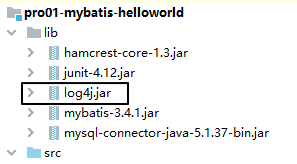

[TOC]

# 一、总体技术体系展望

## 1、单一架构

一个项目，一个工程，导出为一个war包，在一个Tomcat上运行。也叫all in one。


## 2、分布式架构

一个项目，拆分成很多个模块，每个模块是一个工程。每一个工程都是运行在自己的Tomcat上。模块之间可以互相调用。每一个模块内部可以看成是一个单一架构的应用。


# 二、框架的概念


# 三、Mybatis简介

## 1、简要历史

原来的名字叫**ibatis**，从Apache迁移到Google的时候， 改名为**Mybatis**。

## 2、Mybatis和其他持久化层技术对比

### ①开发效率

Hibernate>Mybatis>JDBC

### ②运行效率

JDBC>Mybatis>Hibernate

# 四、Mybatis的HelloWorld

## 1、准备数据库和数据库表

```sql
CREATE DATABASE `mybatis1026`;

USE `mybatis1026`;

CREATE TABLE `t_emp`(
emp_id INT AUTO_INCREMENT,
emp_name CHAR(100),
emp_salary DOUBLE(10,5),
PRIMARY KEY(emp_id)
);

INSERT INTO `t_emp`(emp_name,emp_salary) VALUES("tom",200.33);
```

## 2、创建工程


## 3、创建Java实体类

> 实体类是和现实世界中某一个具体或抽象的概念对应，是软件开发过程中，为了管理现实世界中的数据而设计的模型。
>
> 实体类的多个不同的叫法：
>
> domain：领域模型
>
> entity：实体
>
> POJO：Plain Old Java Object
>
> Java bean：一个Java类

```java
/**
 * 和数据库表t_emp对应的实体类
 * emp_id INT AUTO_INCREMENT
 * emp_name CHAR(100)
 * emp_salary DOUBLE(10,5)
 *
 * Java的实体类中，属性的类型不要使用基本数据类型，要使用包装类型。因为包装类型可以赋值为null，表示空，而基本数据类型不可以。
 */
public class Employee {

    private Integer empId;

    private String empName;

    private Double empSalary;

    public Employee() {

    }

    public Integer getEmpId() {
        return empId;
    }

    public void setEmpId(Integer empId) {
        this.empId = empId;
    }

    public String getEmpName() {
        return empName;
    }

    public void setEmpName(String empName) {
        this.empName = empName;
    }

    public Double getEmpSalary() {
        return empSalary;
    }

    public void setEmpSalary(Double empSalary) {
        this.empSalary = empSalary;
    }

    @Override
    public String toString() {
        return "Employee{" +
                "empId=" + empId +
                ", empName='" + empName + '\'' +
                ", empSalary=" + empSalary +
                '}';
    }

    public Employee(Integer empId, String empName, Double empSalary) {
        this.empId = empId;
        this.empName = empName;
        this.empSalary = empSalary;
    }
}
```

## 4、搭建Mybatis框架的开发环境

### ①导入jar包

- mybatis-3.4.1.jar：Mybatis核心包
- mysql-connector-java-5.1.37-bin.jar：MySQL驱动
- junit-4.12.jar：junit框架
- hamcrest-core-1.3.jar：junit框架

添加到当前工程模块的运行时环境

### ②准备配置文件

#### [1]Mybatis全局配置文件

习惯上命名为mybatis-config.xml，这个文件名仅仅只是建议，并不是强制要求。将来整合Spring之后，这个配置文件可以省略，所以大家操作时可以直接复制、粘贴。

```xml
<?xml version="1.0" encoding="UTF-8" ?>
<!DOCTYPE configuration
        PUBLIC "-//mybatis.org//DTD Config 3.0//EN"
        "http://mybatis.org/dtd/mybatis-3-config.dtd">
<configuration>

    <!-- environments表示配置Mybatis的开发环境，可以配置多个环境，在众多具体环境中，使用default属性指定实际运行时使用的环境 -->
    <environments default="development">
        <!-- environment表示配置Mybatis的一个具体的环境 -->
        <environment id="development">

            <!-- Mybatis的内置的事务管理器 -->
            <transactionManager type="JDBC"/>

            <!-- 配置数据源 -->
            <dataSource type="POOLED">

                <!-- 建立数据库连接的具体信息 -->
                <property name="driver" value="com.mysql.jdbc.Driver"/>
                <property name="url" value="jdbc:mysql://192.168.198.100:3306/mybatis0922"/>
                <property name="username" value="root"/>
                <property name="password" value="atguigu"/>
            </dataSource>
        </environment>
    </environments>

    <mappers>
        <!-- 指定Mybatis映射文件的具体位置 -->
        <mapper resource="com/atguigu/mybatis/dao/EmployeeMapper.xml"/>
    </mappers>
</configuration>
```


注意：配置文件存放的位置是src目录下。

#### [2]Mybatis映射文件

相关概念：ORM（Object Relationship Mapping）对象关系映射。对象指的是Java的实体类对象，关系指的是关系型数据库，映射指的是二者之间的对应关系。

| Java概念 | 数据库概念 |
| -------- | ---------- |
| 类       | 表         |
| 属性     | 字段/列    |
| 对象     | 记录/行    |

```xml
<?xml version="1.0" encoding="UTF-8" ?>
<!DOCTYPE mapper
        PUBLIC "-//mybatis.org//DTD Mapper 3.0//EN"
        "http://mybatis.org/dtd/mybatis-3-mapper.dtd">

<!-- mapper是根标签，namespace属性：在Mybatis全局范围内找到一个具体的Mapper配置 -->
<mapper namespace="com.atguigu.mybatis.dao.EmployeeMapper">

    <!-- 编写具体的SQL语句，使用id属性唯一的标记一条SQL语句 -->
    <!-- resultType属性：指定封装查询结果的Java实体类的全类名 -->
    <select id="selectEmployee" resultType="com.atguigu.mybatis.entity.Employee">
        <!-- Mybatis负责把SQL语句中的#{}部分替换成“?”占位符，在#{}内部还是要声明一个见名知意的名称 -->
        select emp_id empId,emp_name empName,emp_salary empSalary from t_emp where emp_id=#{empId}
    </select>
</mapper>
```

## 5、junit测试代码

```java
@Test
public void testSelectEmployee() throws IOException {

    // 1.创建SqlSessionFactory对象
    // ①声明Mybatis全局配置文件的路径
    String mybatisConfigFilePath = "mybatis-config.xml";

    // ②以输入流的形式加载Mybatis配置文件
    InputStream inputStream = Resources.getResourceAsStream(mybatisConfigFilePath);

    // ③基于读取Mybatis配置文件的输入流创建SqlSessionFactory对象
    SqlSessionFactory sessionFactory = new SqlSessionFactoryBuilder().build(inputStream);

    // 2.使用SqlSessionFactory对象开启一个会话
    SqlSession session = sessionFactory.openSession();

    // 3.根据Mapper配置文件的名称空间+SQL语句的id找到具体的SQL语句
    // 格式是：名称空间.SQL语句的id
    String statement = "com.atguigu.mybatis.dao.EmployeeMapper.selectEmployee";

    // 要传入SQL语句的参数
    Integer empId = 2;

    // 执行SQL语句
    Object result = session.selectOne(statement, empId);

    System.out.println("o = " + result);

    // 4.关闭SqlSession
    session.close();
}
```

说明：

- SqlSession：代表Java程序和<span style="color:blue;font-weight:bold;">数据库</span>之间的会话。（HttpSession是Java程序和浏览器之间的会话）
- SqlSessionFactory：是“生产”SqlSession的“工厂”。
- 工厂模式：如果创建某一个对象，使用的过程基本固定，那么我们就可以把创建这个对象的相关代码封装到一个“工厂类”中，以后都使用这个工厂类来“生产”我们需要的对象。

## 6、图解HelloWorld思路


- 根据Mybatis全局配置文件创建SqlSessionFactory对象
- 根据Mybatis全局配置文件中mappers/mapper配置加载映射配置文件
- 通过SqlSessionFactory对象开启会话，创建SqlSession对象
- 调用SqlSession对象的方法，根据名称空间和SQL的id找到具体的一条SQL语句
- Mybatis底层把SQL语句封装到PreparedStatement对象中发送给数据库执行

## 7、加入log4j日志打印

### ①需求

在Mybatis工作过程中，通过打印日志的方式，将要执行的SQL语句打印出来。

### ②操作

#### [1]加入log4j的jar包



#### [2]加入log4j的配置文件

支持XML和properties属性文件两种形式。无论使用哪种形式，文件名是固定的：

- log4j.xml
- log4j.properties

```xml
<?xml version="1.0" encoding="UTF-8" ?>
<!DOCTYPE log4j:configuration SYSTEM "log4j.dtd">

<log4j:configuration xmlns:log4j="http://jakarta.apache.org/log4j/">

    <appender name="STDOUT" class="org.apache.log4j.ConsoleAppender">
        <param name="Encoding" value="UTF-8" />
        <layout class="org.apache.log4j.PatternLayout">
            <param name="ConversionPattern" value="%-5p %d{MM-dd HH:mm:ss,SSS} %m  (%F:%L) \n" />
        </layout>
    </appender>
    <logger name="java.sql">
        <level value="debug" />
    </logger>
    <logger name="org.apache.ibatis">
        <level value="info" />
    </logger>
    <root>
        <level value="debug" />
        <appender-ref ref="STDOUT" />
    </root>
</log4j:configuration>
```

### ③日志的级别

FATAL(致命)>ERROR(错误)>WARN(警告)>INFO(信息)>DEBUG(调试)<br/>

从左到右打印的内容越来越详细

### ④STDOUT

是standard output的缩写，意思是标准输出。对于Java程序来说，打印到标准输出就是打印到控制台。

## 8、关联外部属性文件

### ①需求

在实际开发时，同一套代码往往会对应多个不同的具体服务器环境。使用的数据库连接参数也不同。为了更好的维护这些信息，我们建议把数据库连接信息提取到Mybatis全局配置文件外边。

### ②做法

创建jdbc.properties配置文件

```properties
wechat.dev.driver=com.mysql.jdbc.Driver
wechat.dev.url=jdbc:mysql://192.168.198.100:3306/mybatis0922
wechat.dev.username=root
wechat.dev.password=atguigu

wechat.test.driver=com.mysql.jdbc.Driver
wechat.test.url=jdbc:mysql://192.168.198.150:3306/mybatis0922
wechat.test.username=root
wechat.test.password=atguigu

wechat.product.driver=com.mysql.jdbc.Driver
wechat.product.url=jdbc:mysql://192.168.198.200:3306/mybatis0922
wechat.product.username=root
wechat.product.password=atguigu
```

在Mybatis全局配置文件中指定外部jdbc.properties文件的位置

```xml
<properties resource="jdbc.properties"/>
```

在需要具体属性值的时候使用${key}格式引用属性文件中的键

```xml
<dataSource type="POOLED">

    <!-- 建立数据库连接的具体信息（引用了外部属性文件中的数据） -->
    <property name="driver" value="${wechat.dev.driver}"/>
    <property name="url" value="${wechat.dev.url}"/>
    <property name="username" value="${wechat.dev.username}"/>
    <property name="password" value="${wechat.dev.password}"/>

</dataSource>
```


## 9、用上Mapper接口

Mybatis中的Mapper接口相当于以前的Dao。但是区别在于，Mapper仅仅是接口，我们不需要提供实现类。

### ①思路


### ②调整junit代码

```java
public class PromotedMybatisTest {

    private SqlSessionFactory sessionFactory;

    @Before
    public void init() throws IOException {
        // 1.创建SqlSessionFactory对象
        // ①声明Mybatis全局配置文件的路径
        String mybatisConfigFilePath = "mybatis-config.xml";

        // ②以输入流的形式加载Mybatis配置文件
        InputStream inputStream = Resources.getResourceAsStream(mybatisConfigFilePath);

        // ③基于读取Mybatis配置文件的输入流创建SqlSessionFactory对象
        sessionFactory = new SqlSessionFactoryBuilder().build(inputStream);

    }

    @Test
    public void testSelectEmployee() throws IOException {

        SqlSession session = sessionFactory.openSession();

        

        session.close();
    }

}
```

### ③完成Mapper接口

```java
public interface EmployeeMapper {

    Employee selectEmployee(Integer empId);
    
}
```

- 方法名和SQL的id一致
- 方法返回值和resultType一致
- 方法的参数和SQL的参数一致
- 接口的全类名和映射配置文件的名称空间一致

### ④最终的junit测试方法

```java
@Test
public void testSelectEmployee() throws IOException {

    // 1.从工厂对象中获取SqlSession对象
    SqlSession session = sessionFactory.openSession();

    // 2.通过SqlSession对象获取Mapper接口对象
    EmployeeMapper employeeMapper = session.getMapper(EmployeeMapper.class);

    // 3.调用Mapper接口的方法
    Employee employee = employeeMapper.selectEmployee(2);

    // 4.打印返回值
    System.out.println("employee = " + employee);

    // 5.关闭Session
    session.close();
}
```


## 10、增删改操作

### ①insert

SQL语句

```xml
<insert id="insertEmployee">
    insert into t_emp(emp_name,emp_salary) values(#{empName},#{empSalary})
</insert>
```

Java代码中的Mapper接口：

```java
public interface EmployeeMapper {

    Employee selectEmployee(Integer empId);

    int insertEmployee(Employee employee);
}
```

Java代码中的junit测试：

```java
@Test
public void testSaveEmployee() {

    SqlSession session = sessionFactory.openSession();

    EmployeeMapper employeeMapper = session.getMapper(EmployeeMapper.class);

    // 创建要保存到数据库的对象
    Employee employee = new Employee();

    // 给实体类对象设置具体属性值
    employee.setEmpName("jerry");
    employee.setEmpSalary(5000.33);

    // 执行保存操作
    int result = employeeMapper.insertEmployee(employee);

    // 打印受影响的行数
    System.out.println("result = " + result);

    // 提交事务
    session.commit();

    session.close();
}
```

### ②delete

SQL语句

```xml
    <delete id="deleteEmployee">
        delete from t_emp where emp_id=#{empId}
    </delete>
```

Java代码中的Mapper接口：

```java
public interface EmployeeMapper {

    Employee selectEmployee(Integer empId);

    int insertEmployee(Employee employee);

    int deleteEmployee(Integer empId);
}
```

Java代码中的junit测试：

```java
@Test
public void testRemoveEmployee() {
    SqlSession session = sessionFactory.openSession();

    EmployeeMapper employeeMapper = session.getMapper(EmployeeMapper.class);

    int result = employeeMapper.deleteEmployee(1);

    System.out.println("result = " + result);

    session.commit();

    session.close();
}
```

### ③update

SQL语句：

```xml
<update id="updateEmployee">
    update t_emp set emp_name=#{empName},emp_salary=#{empSalary} where emp_id=#{empId}
</update>
```

Java代码中的Mapper接口：

```java
public interface EmployeeMapper {

    Employee selectEmployee(Integer empId);

    int insertEmployee(Employee employee);

    int deleteEmployee(Integer empId);

    int updateEmployee(Employee employee);
}
```

Java代码中的junit测试：

```java
@Test
public void testUpdateEmployee() {
    SqlSession session = sessionFactory.openSession();

    EmployeeMapper employeeMapper = session.getMapper(EmployeeMapper.class);

    Employee employee = new Employee(2, "AAAAAA", 6666.66);

    int result = employeeMapper.updateEmployee(employee);

    System.out.println("result = " + result);

    session.commit();

    session.close();
}
```


# 五、给SQL语句传参

## 1、#{}方式

Mybatis会在运行过程中，把配置文件中的SQL语句里面的#{}转换为“?”占位符，发送给数据库执行。

配置文件中的SQL：

```xml
<delete id="deleteEmployeeById">
    delete from t_emp where emp_id=#{empId}
</delete>
```

实际执行的SQL：

```sql
delete from t_emp where emp_id=?
```

## 2、${}方式

将来会根据${}拼字符串

### ①SQL语句

```xml
<select id="selectEmployeeByName" resultType="com.atguigu.mybatis.entity.Employee">
    select emp_id empId,emp_name empName,emp_salary empSalary from t_emp where emp_name like '%${empName}%'
</select>
```

### ②Mapper接口

注意：<span style="color:red;font-weight:bold;">Mapper接口中不能出现重名的方法</span>，哪怕是重载的方法也不行！

```java
public interface EmployeeMapper {

    Employee selectEmployee(Integer empId);

    Employee selectEmployeeByName(@Param("empName") String empName);

    int insertEmployee(Employee employee);

    int deleteEmployee(Integer empId);

    int updateEmployee(Employee employee);
}
```

### ③junit测试

```java
@Test
public void testDollar() {
    SqlSession session = sessionFactory.openSession();

    EmployeeMapper employeeMapper = session.getMapper(EmployeeMapper.class);

    Employee employee = employeeMapper.selectEmployeeByName("r");

    System.out.println("employee = " + employee);

    session.commit();

    session.close();
}
```

### ④实际打印的SQL

```sql
select emp_id empId,emp_name empName,emp_salary empSalary from t_emp where emp_name like '%r%'
```

### ⑤应用场景举例

在SQL语句中，数据库表的表名不确定，需要外部动态传入，此时不能使用#{}，因为数据库不允许表名位置使用问号占位符，此时只能使用${}。<br/>

其他情况，<span style="color:red;font-weight:bold;">只要能用#{}肯定不用${}</span>，避免SQL注入。


# 六、数据输入

## 0、Mybatis总体机制概括


## 1、概念说明

这里数据输入具体是指上层方法（例如Service方法）调用Mapper接口时，数据传入的形式。

- 简单类型：只包含一个值的数据类型
  - 基本数据类型：int、byte、short、double、……
  - 基本数据类型的包装类型：Integer、Character、Double、……
  - 字符串类型：String
- 复杂类型：包含多个值的数据类型
  - 实体类类型：Employee、Department、……
  - 集合类型：List、Set、Map、……
  - 数组类型：int[]、String[]、……
  - 复合类型：List&lt;Employee&gt;、实体类中包含集合……

## 2、单个简单类型参数

### ①Mapper接口中抽象方法的声明

```java
Employee selectEmployee(Integer empId);
```

### ②SQL语句

```xml
<select id="selectEmployee" resultType="com.atguigu.mybatis.entity.Employee">
    select emp_id empId,emp_name empName,emp_salary empSalary from t_emp where emp_id=#{empId}
</select>
```

## 3、实体类类型参数

### ①Mapper接口中抽象方法的声明

```java
int insertEmployee(Employee employee);
```

### ②SQL语句

```xml
<insert id="insertEmployee">
    insert into t_emp(emp_name,emp_salary) values(#{empName},#{empSalary})
</insert>
```

### ③对应关系


### ④结论

Mybatis会根据#{}中传入的数据，加工成getXxx()方法，通过反射在实体类对象中调用这个方法，从而获取到对应的数据。填充到#{}这个位置。

## 4、零散的简单类型数据

### ①Mapper接口中抽象方法的声明

```java
int updateEmployee(@Param("empId") Integer empId,@Param("empSalary") Double empSalary);
```

### ②SQL语句

```xml
    <update id="updateEmployee">
        update t_emp set emp_salary=#{empSalary} where emp_id=#{empId}
    </update>
```

### ③对应关系


## 5、Map类型参数

### ①Mapper接口中抽象方法的声明

```java
int updateEmployeeByMap(Map<String, Object> paramMap);
```

### ②SQL语句

```xml
    <update id="updateEmployeeByMap">
        update t_emp set emp_salary=#{empSalaryKey} where emp_id=#{empIdKey}
    </update>
```

### ③junit测试

```java
@Test
public void testUpdateEmpNameByMap() {
    SqlSession session = sessionFactory.openSession();

    EmployeeMapper mapper = session.getMapper(EmployeeMapper.class);

    Map<String, Object> paramMap = new HashMap<>();

    paramMap.put("empSalaryKey", 999.99);
    paramMap.put("empIdKey", 5);

    int result = mapper.updateEmployeeByMap(paramMap);

    System.out.println("result = " + result);

    session.commit();

    session.close();
}
```

### ④对应关系

#{}中写Map中的key

### ⑤使用场景

有很多零散的参数需要传递，但是没有对应的实体类类型可以使用。使用@Param注解一个一个传入又太麻烦了。所以都封装到Map中。

# 七、数据输出

## 1、返回单个简单类型数据

### ①Mapper接口中的抽象方法

```java
int selectEmpCount();
```

### ②SQL语句

```java
    <select id="selectEmpCount" resultType="int">
        select count(*) from t_emp
    </select>
```

### ③junit测试

```java
    @Test
    public void testEmpCount() {

        SqlSession session = sessionFactory.openSession();

        EmployeeMapper employeeMapper = session.getMapper(EmployeeMapper.class);

        int count = employeeMapper.selectEmpCount();

        System.out.println("count = " + count);

        session.commit();

        session.close();
    }
```


## 2、返回实体类对象

### ①Mapper接口的抽象方法

```java
Employee selectEmployee(Integer empId);
```

### ②SQL语句

```xml
<!-- 编写具体的SQL语句，使用id属性唯一的标记一条SQL语句 -->
<!-- resultType属性：指定封装查询结果的Java实体类的全类名 -->
<select id="selectEmployee" resultType="com.atguigu.mybatis.entity.Employee">
    <!-- Mybatis负责把SQL语句中的#{}部分替换成“?”占位符 -->
    <!-- 给每一个字段设置一个别名，让别名和Java实体类中属性名一致 -->
    select emp_id empId,emp_name empName,emp_salary empSalary from t_emp where emp_id=#{maomi}
</select>
```

通过给数据库表字段加别名，让查询结果的每一列都和Java实体类中属性对应起来。

## 3、返回Map类型

适用于SQL查询返回的各个字段综合起来并不和任何一个现有的实体类对应，没法封装到实体类对象中。<span style="color:red;font-weight:bold;">能够封装成实体类类型的，就不使用Map类型</span>。

### ①Mapper接口的抽象方法

```java
Map<String,Object> selectEmpNameAndMaxSalary();
```

### ②SQL语句

```xml
<!-- Map<String,Object> selectEmpNameAndMaxSalary(); -->
<!-- 返回工资最高的员工的姓名和他的工资 -->
<select id="selectEmpNameAndMaxSalary" resultType="map">
        SELECT
            emp_name 员工姓名,
            emp_salary 员工工资,
            (SELECT AVG(emp_salary) FROM t_emp) 部门平均工资
        FROM t_emp WHERE emp_salary=(
            SELECT MAX(emp_salary) FROM t_emp
        )
</select>
```

### ③junit测试

```java
    @Test
    public void testQueryEmpNameAndSalary() {

        SqlSession session = sessionFactory.openSession();

        EmployeeMapper employeeMapper = session.getMapper(EmployeeMapper.class);

        Map<String, Object> resultMap = employeeMapper.selectEmpNameAndMaxSalary();

        Set<Map.Entry<String, Object>> entrySet = resultMap.entrySet();

        for (Map.Entry<String, Object> entry : entrySet) {
            String key = entry.getKey();
            Object value = entry.getValue();
            System.out.println(key + "=" + value);
        }

        session.commit();

        session.close();
    }
```


## 4、返回List类型

查询结果返回多个实体类对象，希望把多个实体类对象放在List集合中返回。此时不需要任何特殊处理，在resultType属性中还是设置实体类类型即可。

### ①Mapper接口中抽象方法

```java
List<Employee> selectAll();
```

### ②SQL语句

```xml
    <!-- List<Employee> selectAll(); -->
    <select id="selectAll" resultType="com.atguigu.mybatis.entity.Employee">
        select emp_id empId,emp_name empName,emp_salary empSalary
        from t_emp
    </select>
```

### ③junit测试

```java
    @Test
    public void testSelectAll() {

        SqlSession session = sessionFactory.openSession();

        EmployeeMapper employeeMapper = session.getMapper(EmployeeMapper.class);

        List<Employee> employeeList = employeeMapper.selectAll();

        for (Employee employee : employeeList) {
            System.out.println("employee = " + employee);
        }

        session.commit();

        session.close();
    }
```


## 5、返回自增主键

### ①使用场景

例如：保存订单信息。需要保存Order对象和List&lt;OrderItem&gt;。其中，OrderItem对应的数据库表，包含一个外键，指向Order对应表的主键。<br/>

在保存List&lt;OrderItem的时候，需要使用下面的SQL：

```sql
insert into t_order_item(item_name,item_price,item_count,order_id) values(...)
```

这里需要用到的order_id，是在保存Order对象时，数据库表以自增方式产生的，需要特殊办法拿到这个自增的主键值。至于，为什么不能通过查询最大主键的方式解决这个问题，参考下图：


### ②在Mapper配置文件中设置方式

#### [1]Mapper接口中的抽象方法

```java
int insertEmployee(Employee employee);
```

#### [2]SQL语句

```xml
<!-- int insertEmployee(Employee employee); -->
<!-- useGeneratedKeys属性字面意思就是“使用生成的主键” -->
<!-- keyProperty属性可以指定主键在实体类对象中对应的属性名，Mybatis会将拿到的主键值存入这个属性 -->
<insert id="insertEmployee" useGeneratedKeys="true" keyProperty="empId">
    insert into t_emp(emp_name,emp_salary)
    values(#{empName},#{empSalary})
</insert>
```

### [3]junit测试

```java
@Test
public void testSaveEmp() {
    SqlSession session = sessionFactory.openSession();

    EmployeeMapper employeeMapper = session.getMapper(EmployeeMapper.class);

    Employee employee = new Employee();
    
    employee.setEmpName("john");
    employee.setEmpSalary(666.66);

    employeeMapper.insertEmployee(employee);

    System.out.println("employee.getEmpId() = " + employee.getEmpId());
    
    session.commit();
    session.close();
}
```

### ④注意

Mybatis是将自增主键的值设置到实体类对象中，而<span style="color:blue;font-weight:bold;">不是以Mapper接口方法返回值</span>的形式返回。

### ⑤不支持自增主键的数据库

而对于不支持自增型主键的数据库（例如 Oracle），则可以使用 selectKey 子元素：selectKey  元素将会首先运行，id  会被设置，然后插入语句会被调用

```xml
<insert id="insertEmployee" 
		parameterType="com.atguigu.mybatis.beans.Employee"  
			databaseId="oracle">
		<selectKey order="BEFORE" keyProperty="id" 
                                       resultType="integer">
			select employee_seq.nextval from dual 
		</selectKey>	
		insert into orcl_employee(id,last_name,email,gender) values(#{id},#{lastName},#{email},#{gender})
</insert>
```

或者是

```xml
<insert id="insertEmployee" 
		parameterType="com.atguigu.mybatis.beans.Employee"  
			databaseId="oracle">
		<selectKey order="AFTER" keyProperty="id" 
                                         resultType="integer">
			select employee_seq.currval from dual 
		</selectKey>	
	insert into orcl_employee(id,last_name,email,gender) values(employee_seq.nextval,#{lastName},#{email},#{gender})
</insert>
```


## 6、数据库表字段和实体类属性对应关系

### ①别名

将字段的别名设置成和实体类属性一致。

```xml
<!-- 编写具体的SQL语句，使用id属性唯一的标记一条SQL语句 -->
<!-- resultType属性：指定封装查询结果的Java实体类的全类名 -->
<select id="selectEmployee" resultType="com.atguigu.mybatis.entity.Employee">
    <!-- Mybatis负责把SQL语句中的#{}部分替换成“?”占位符 -->
    <!-- 给每一个字段设置一个别名，让别名和Java实体类中属性名一致 -->
    select emp_id empId,emp_name empName,emp_salary empSalary from t_emp where emp_id=#{maomi}
</select>
```

> 关于实体类属性的约定：
>
> getXxx()方法、setXxx()方法把方法名中的get或set去掉，首字母小写。

### ②全局配置自动识别驼峰式命名规则

在Mybatis全局配置文件加入如下配置：

```xml
<!-- 使用settings对Mybatis全局进行设置 -->
<settings>
    <!-- 将xxx_xxx这样的列名自动映射到xxXxx这样驼峰式命名的属性名 -->
    <setting name="mapUnderscoreToCamelCase" value="true"/>
</settings>
```

SQL语句中可以不使用别名

```xml
<!-- Employee selectEmployee(Integer empId); -->
<select id="selectEmployee" resultType="com.atguigu.mybatis.entity.Employee">
    select emp_id,emp_name,emp_salary from t_emp where emp_id=#{empId}
</select>
```


### ③使用resultMap

使用resultMap标签定义对应关系，再在后面的SQL语句中引用这个对应关系

```xml
<!-- 专门声明一个resultMap设定column到property之间的对应关系 -->
<resultMap id="selectEmployeeByRMResultMap" type="com.atguigu.mybatis.entity.Employee">

    <!-- 使用id标签设置主键列和主键属性之间的对应关系 -->
    <!-- column属性用于指定字段名；property属性用于指定Java实体类属性名 -->
    <id column="emp_id" property="empId"/>

    <!-- 使用result标签设置普通字段和Java实体类属性之间的关系 -->
    <result column="emp_name" property="empName"/>
    <result column="emp_salary" property="empSalary"/>
</resultMap>

<!-- Employee selectEmployeeByRM(Integer empId); -->
<select id="selectEmployeeByRM" resultMap="selectEmployeeByRMResultMap">
    select emp_id,emp_name,emp_salary from t_emp where emp_id=#{empId}
</select>
```

