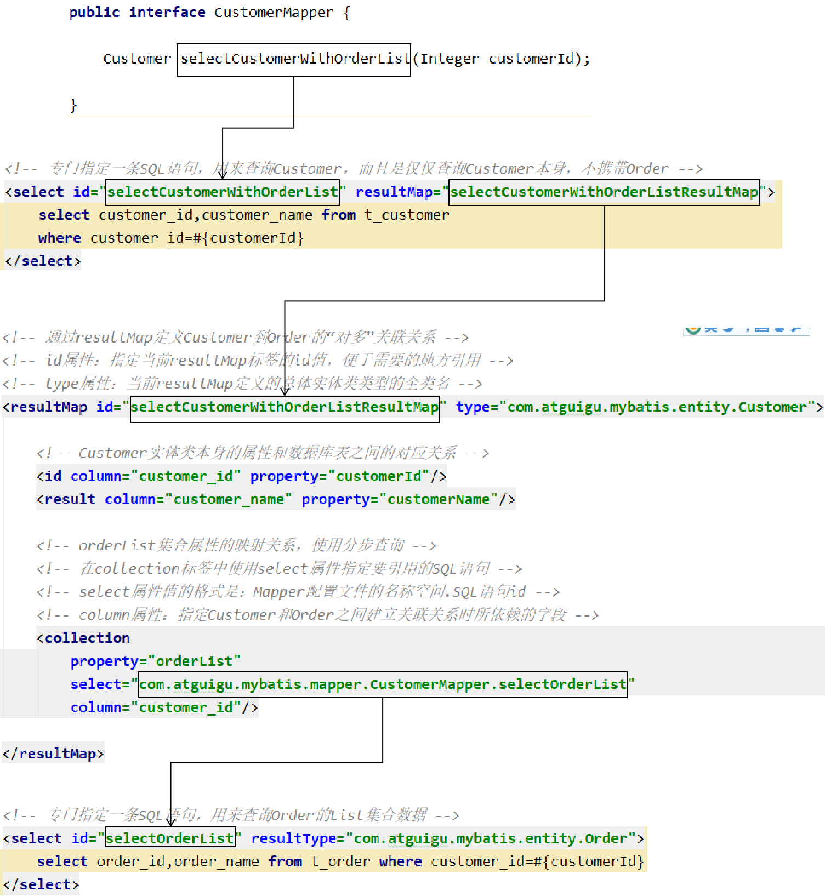
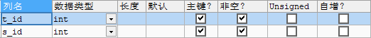

[TOC]

# 一、关联关系

## 1、关联关系概念说明

- 一对一

  夫妻关系，人和身份证号

- 一对多

  用户和用户的订单，锁和钥匙

- 多对多

  老师和学生，部门和员工

## 2、创建模型

### ①创建实体类

```java
public class Customer {

    private Integer customerId;
    private String customerName;
    private List<Order> orderList;// 体现的是对多的关系
```

```java
public class Order {

    private Integer orderId;
    private String orderName;
    private Customer customer;// 体现的是对一的关系
```

> 双向关联关系：双方都能够引用到对方
>
> Customer中能够引用Order
>
> Order中能够引用Customer
>
> 在双向关联关系中使用toString()等方法时注意避免无限死循环。


> 单向关联关系：双方中只有一方能够引用到对方
>
> Customer中没有引用Order
>
> Order中引用了Customer

### ②创建数据库表插入测试数据

```sql
CREATE TABLE `t_customer` (
	 `customer_id` INT NOT NULL AUTO_INCREMENT, 
	 `customer_name` CHAR(100), 
	 PRIMARY KEY (`customer_id`) 
 ); 

CREATE TABLE `t_order` ( 
	`order_id` INT NOT NULL AUTO_INCREMENT, 
	`order_name` CHAR(100), 
	`customer_id` INT, 
	PRIMARY KEY (`order_id`) 
); 
INSERT INTO `t_customer` (`customer_name`) VALUES ('c01');
INSERT INTO `t_order` (`order_name`, `customer_id`) VALUES ('o1', '1'); 
INSERT INTO `t_order` (`order_name`, `customer_id`) VALUES ('o2', '1'); 
INSERT INTO `t_order` (`order_name`, `customer_id`) VALUES ('o3', '1'); 
```

> 实际开发时，一般在开发过程中，不给数据库表设置外键约束。
>
> 原因是避免调试不方便。
>
> 一般是功能开发完成，再加外键约束检查是否有bug。

## 2、Mybatis实现关联关系：对一

### ①创建OrderMapper接口

```java
public interface OrderMapper {
    
    Order selectOrderWithCustomer(Integer orderId);
    
}
```

### ②创建OrderMapper.xml配置文件

```xml
<!-- 创建resultMap实现“对一”关联关系映射 -->
<!-- id属性：通常设置为这个resultMap所服务的那条SQL语句的id加上“ResultMap” -->
<!-- type属性：要设置为这个resultMap所服务的那条SQL语句最终要返回的类型 -->
<resultMap id="selectOrderWithCustomerResultMap" type="com.atguigu.mybatis.entity.Order">

    <!-- 先设置Order自身属性和字段的对应关系 -->
    <id column="order_id" property="orderId"/>
    <result column="order_name" property="orderName"/>

    <!-- 使用association标签配置“对一”关联关系 -->
    <!-- property属性：在Order类中对一的一端进行引用时使用的属性名 -->
    <!-- javaType属性：一的一端类的全类名 -->
    <association property="customer" javaType="com.atguigu.mybatis.entity.Customer">
        <!-- 配置Customer类的属性和字段名之间的对应关系 -->
        <id column="customer_id" property="customerId"/>
        <result column="customer_name" property="customerName"/>
    </association>

</resultMap>

<!-- Order selectOrderWithCustomer(Integer orderId); -->
<select id="selectOrderWithCustomer" resultMap="selectOrderWithCustomerResultMap">
    SELECT order_id,order_name,c.customer_id,customer_name
    FROM t_order o
    LEFT JOIN t_customer c
    ON o.customer_id=c.customer_id
    WHERE o.order_id=#{orderId}
</select>
```

### ③在Mybatis全局配置文件中注册Mapper配置文件

```xml
<!-- 注册Mapper配置文件：告诉Mybatis我们的Mapper配置文件的位置 -->
<mappers>
    <!-- 在mapper标签的resource属性中指定Mapper配置文件以“类路径根目录”为基准的相对路径 -->
    <mapper resource="com/atguigu/mybatis/mapper/OrderMapper.xml"/>
</mappers>
```

### ④junit测试程序

```java
@Test
public void testRelationshipToOne() {
    SqlSession session = factory.openSession();
    OrderMapper orderMapper = session.getMapper(OrderMapper.class);

    // 查询Order对象，检查是否同时查询了关联的Customer对象
    Order order = orderMapper.selectOrderWithCustomer(2);
    System.out.println("order = " + order);

    session.close();
}
```

### ⑤关键词

在“对一”关联关系中，我们的配置比较多，但是关键词就只有：<span style="color:blue;font-weight:bold;">association</span>和<span style="color:blue;font-weight:bold;">javaType</span>

## 3、Mybatis实现关联关系：对多

### ①创建Mapper接口

```java
public interface CustomerMapper {
    
    Customer selectCustomerWithOrderList(Integer customerId);
    
}
```

### ②创建CustomerMapper.xml配置文件

注意：不要忘记在Mybatis全局配置文件中注册

### ③在Mapper.xml配置文件中配置关联关系和SQL语句

```xml
<!-- 配置resultMap实现从Customer到OrderList的“对多”关联关系 -->
<resultMap id="selectCustomerWithOrderListResultMap"
           type="com.atguigu.mybatis.entity.Customer">

    <!-- 映射Customer本身的属性 -->
    <id column="customer_id" property="customerId"/>
    <result column="customer_name" property="customerName"/>

    <!-- collection标签：映射“对多”的关联关系 -->
    <!-- property属性：在Customer类中，关联“多”的一端的属性名 -->
    <!-- ofType属性：集合属性中元素的类型 -->
    <collection property="orderList" ofType="com.atguigu.mybatis.entity.Order">
        <!-- 映射Order的属性 -->
        <id column="order_id" property="orderId"/>
        <result column="order_name" property="orderName"/>

    </collection>

</resultMap>

<!-- Customer selectCustomerWithOrderList(Integer customerId); -->
<select id="selectCustomerWithOrderList" resultMap="selectCustomerWithOrderListResultMap">
    SELECT c.customer_id,c.customer_name,o.order_id,o.order_name
    FROM t_customer c
    LEFT JOIN t_order o
    ON c.customer_id=o.customer_id
    WHERE c.customer_id=#{customerId}
</select>
```

### ④junit测试

```java
@Test
public void testRelationshipToMulti() {
    SqlSession session = factory.openSession();
    CustomerMapper customerMapper = session.getMapper(CustomerMapper.class);

    // 查询Customer对象同时将关联的Order集合查询出来
    Customer customer = customerMapper.selectCustomerWithOrderList(1);

    System.out.println("customer.getCustomerId() = " + customer.getCustomerId());
    System.out.println("customer.getCustomerName() = " + customer.getCustomerName());

    List<Order> orderList = customer.getOrderList();
    for (Order order : orderList) {
        System.out.println("order = " + order);
    }

    session.close();
}
```

### ⑤关键词

在“对多”关联关系中，同样有很多配置，但是提炼出来最关键的就是：“<span style="color:blue;font-weight:bold;">collection</span>”和“<span style="color:blue;font-weight:bold;">ofType</span>”

## 4、分步查询

### ①概念和需求

为了实现延迟加载，对Customer和Order的查询必须分开，分成两步来做，才能够实现。为此，我们需要单独查询Order，也就是需要在Mapper配置文件中，单独编写查询Order集合数据的SQL语句。

### ②具体操作

#### [1]编写查询Customer的SQL语句

```xml
<!-- 专门指定一条SQL语句，用来查询Customer，而且是仅仅查询Customer本身，不携带Order -->
<select id="selectCustomerWithOrderList" resultMap="selectCustomerWithOrderListResultMap">
    select customer_id,customer_name from t_customer
    where customer_id=#{customerId}
</select>
```


#### [2]编写查询Order的SQL语句

```xml
<select id="selectOrderList" resultType="com.atguigu.mybatis.entity.Order">
    select order_id,order_name from t_order where customer_id=#{customer_id}
</select>
```


#### [3]在collection标签中引用这条查询Order的SQL语句

```xml
<!-- orderList集合属性的映射关系，使用分步查询 -->
<!-- 在collection标签中使用select属性指定要引用的SQL语句 -->
<!-- select属性值的格式是：Mapper配置文件的名称空间.SQL语句id -->
<!-- column属性：指定Customer和Order之间建立关联关系时所依赖的字段 -->
<collection
    property="orderList"
    select="com.atguigu.mybatis.mapper.CustomerMapper.selectOrderList"
    column="customer_id"/>
```

如果Mapper接口中的抽象方法没有改变，那么juni测试也不变。执行结果如下：

```java
DEBUG 11-30 11:10:05,796 ==>  Preparing: select customer_id,customer_name from t_customer where customer_id=?   (BaseJdbcLogger.java:145) 
DEBUG 11-30 11:10:05,866 ==> Parameters: 1(Integer)  (BaseJdbcLogger.java:145) 
DEBUG 11-30 11:10:05,889 ====>  Preparing: select order_id,order_name from t_order where customer_id=?   (BaseJdbcLogger.java:145) 
DEBUG 11-30 11:10:05,890 ====> Parameters: 1(Integer)  (BaseJdbcLogger.java:145) 
DEBUG 11-30 11:10:05,895 <====      Total: 3  (BaseJdbcLogger.java:145) 
DEBUG 11-30 11:10:05,896 <==      Total: 1  (BaseJdbcLogger.java:145) 
customer = c01
order = Order{orderId=1, orderName='o1'}
order = Order{orderId=2, orderName='o2'}
order = Order{orderId=3, orderName='o3'}
```


### ③各个要素之间的对应关系




## 5、延迟加载

### ①概念

查询到Customer的时候，不一定会使用Order的List集合数据。如果Order的集合数据始终没有使用，那么这部分数据占用的内存就浪费了。对此，我们希望不一定会被用到的数据，能够在需要使用的时候再去查询。<br/>

例如：对Customer进行1000次查询中，其中只有15次会用到Order的集合数据，那么就在需要使用时才去查询能够大幅度节约内存空间。<br/>

<span style="color:blue;font-weight:bold;">延迟加载</span>的概念：对于实体类关联的属性到<span style="color:blue;font-weight:bold;">需要使用</span>时才查询。也叫<span style="color:blue;font-weight:bold;">懒加载</span>。

### ②配置

在Mybatis全局配置文件中配置settings

```xml
<!-- 使用settings对Mybatis全局进行设置 -->
<settings>
    <!-- 开启延迟加载功能：需要配置两个配置项 -->
    <!-- 1、将lazyLoadingEnabled设置为true，开启懒加载功能 -->
    <setting name="lazyLoadingEnabled" value="true"/>

    <!-- 2、将aggressiveLazyLoading设置为false，关闭“积极的懒加载” -->
    <setting name="aggressiveLazyLoading" value="false"/>
</settings>
```

> 官方文档中对aggressiveLazyLoading属性的解释：
>
> When enabled, an object with lazy loaded properties will be loaded entirely upon a call to any of the lazy properties.Otherwise, each property is loaded on demand.

### ③修改junit测试

```java
@Test
public void testSelectCustomerWithOrderList() throws InterruptedException {
    SqlSession session = sessionFactory.openSession();

    CustomerMapper mapper = session.getMapper(CustomerMapper.class);

    Customer customer = mapper.selectCustomerWithOrderList(1);


    // 这里必须只打印“customerId或customerName”这样已经加载的属性才能看到延迟加载的效果
    // 这里如果打印Customer对象整体则看不到效果
    System.out.println("customer = " + customer.getCustomerName());

    // 先指定具体的时间单位，然后再让线程睡一会儿
    TimeUnit.SECONDS.sleep(5);

    List<Order> orderList = customer.getOrderList();

    for (Order order : orderList) {
        System.out.println("order = " + order);
    }

    session.commit();
    session.close();
}
```

效果：刚开始先查询Customer本身，需要用到OrderList的时候才发送SQL语句去查询

```java
DEBUG 11-30 11:25:31,127 ==>  Preparing: select customer_id,customer_name from t_customer where customer_id=?   (BaseJdbcLogger.java:145) 
DEBUG 11-30 11:25:31,193 ==> Parameters: 1(Integer)  (BaseJdbcLogger.java:145) 
DEBUG 11-30 11:25:31,314 <==      Total: 1  (BaseJdbcLogger.java:145) 
customer = c01
DEBUG 11-30 11:25:36,316 ==>  Preparing: select order_id,order_name from t_order where customer_id=?   (BaseJdbcLogger.java:145) 
DEBUG 11-30 11:25:36,316 ==> Parameters: 1(Integer)  (BaseJdbcLogger.java:145) 
DEBUG 11-30 11:25:36,321 <==      Total: 3  (BaseJdbcLogger.java:145) 
order = Order{orderId=1, orderName='o1'}
order = Order{orderId=2, orderName='o2'}
order = Order{orderId=3, orderName='o3'}
```

## 6、关键词总结

我们是在“对多”关系中举例说明延迟加载的，在“对一”中配置方式基本一样。

| 关联关系 | 配置项关键词                                                 | 所在配置文件                    |
| -------- | ------------------------------------------------------------ | ------------------------------- |
| 对一     | association标签/javaType属性                                 | Mapper配置文件中的resultMap     |
| 对多     | collection标签/ofType属性                                    | Mapper配置文件中的resultMap     |
| 对一分步 | association标签/select属性                                   | Mapper配置文件中的resultMap     |
| 对多分步 | collection标签/select属性                                    | Mapper配置文件中的resultMap     |
| 延迟加载 | lazyLoadingEnabled设置为true<br />aggressiveLazyLoading设置为false | Mybatis全局配置文件中的settings |

## 7、多对多关联需中间表

### ①如果不使用中间表


在某一个表中，使用一个字段保存多个“外键”值，这将导致无法使用SQL语句进行关联查询。

### ②使用中间表


这样就可以使用SQL进行关联查询了。只是有可能需要三张表进行关联。

### ③中间表设置主键

#### [1]方案一：另外设置一个专门的主键字段


#### [2]方案二：使用联合主键




使用联合主键时，只要多个字段的组合不重复即可，单个字段内部是可以重复的。

# 二、动态SQL

## 1、需求

Mybatis框架的动态SQL技术是一种根据特定条件动态拼装SQL语句的功能，它存在的意义是为了解决拼接SQL语句字符串时的痛点问题。

> One of the most powerful features of MyBatis has always been its Dynamic SQL capabilities. If you have any experience with JDBC or any similar framework, you understand how painful it is to conditionally concatenate strings of SQL together, making sure not to forget spaces or to omit a comma at the end of a list of columns. Dynamic SQL can be downright painful to deal with.
>
> MyBatis的一个强大的特性之一通常是它的动态SQL能力。如果你有使用JDBC或其他相似框架的经验，你就明白条件地串联SQL字符串在一起是多么的痛苦，确保不能忘了空格或在列表的最后省略逗号。动态SQL可以彻底处理这种痛苦。

## 2、if和where标签

```xml
<!-- List<Employee> selectEmployeeByCondition(Employee employee); -->
<select id="selectEmployeeByCondition" resultType="com.atguigu.mybatis.entity.Employee">
    select emp_id,emp_name,emp_salary from t_emp

    <!-- where标签会自动去掉“标签体内前面、后面多余的and/or” -->
    <where>
        <!-- 使用if标签，让我们可以有选择的加入SQL语句的片段。这个SQL语句片段是否要加入整个SQL语句，就看if标签判断的结果是否为true -->
        <!-- 在if标签的test属性中，可以访问实体类的属性，不可以访问数据库表的字段 -->
        <if test="empName != null">
            <!-- 在if标签内部，需要访问接口的参数时还是正常写#{} -->
            or emp_name=#{empName}
        </if>
        <if test="empSalary &gt; 2000">
            or emp_salary>#{empSalary}
        </if>
        <!--
         第一种情况：所有条件都满足 WHERE emp_name=? or emp_salary>?
         第二种情况：部分条件满足 WHERE emp_salary>?
         第三种情况：所有条件都不满足 没有where子句
         -->
    </where>
</select>
```

## 3、trim标签

```xml
<!-- List<Employee> selectEmployeeByConditionByTrim(Employee employee) -->
<select id="selectEmployeeByConditionByTrim" resultType="com.atguigu.mybatis.entity.Employee">
    select emp_id,emp_name,emp_age,emp_salary,emp_gender
    from t_emp
    <!-- 使用trim标签控制条件部分两端是否包含某些字符 -->
    <!-- prefix属性指定要动态添加的前缀 -->
    <!-- suffix属性指定要动态添加的后缀 -->
    <!-- prefixOverrides属性指定要动态去掉的前缀，使用“|”分隔有可能的多个值 -->
    <!-- suffixOverrides属性指定要动态去掉的后缀，使用“|”分隔有可能的多个值 -->
    <!-- 当前例子用where标签实现更简洁，但是trim标签更灵活，可以用在任何有需要的地方 -->
    <trim prefix="where" suffixOverrides="and|or">
        <if test="empName != null">
            emp_name=#{empName} and
        </if>
        <if test="empSalary &gt; 3000">
            emp_salary>#{empSalary} and
        </if>
        <if test="empAge &lt;= 20">
            emp_age=#{empAge} or
        </if>
        <if test="empGender=='male'">
            emp_gender=#{empGender}
        </if>
    </trim>
</select>
```

## 4、set标签

### ①相关业务需求举例

实际开发时，对一个实体类对象进行更新。往往不是更新所有字段，而是更新一部分字段。此时页面上的表单往往不会给不修改的字段提供表单项。

```html
<form action="" method="">

	<input type="hidden" name="userId" value="5232" />
	
	年  龄：<input type="text" name="userAge" /><br/>
	性  别：<input type="text" name="userGender" /><br/>
	坐  标：<input type="text" name="userPosition" /><br/>
	<!-- 用户名：<input type="text" name="userName" /><br/>   -->
	<!-- 余  额：<input type="text" name="userBalance" /><br/>-->
	<!-- 等  级：<input type="text" name="userGrade" /><br/>  -->
	
	<button type="submit">修改</button>
	
</form>
```

例如上面的表单，如果服务器端接收表单时，使用的是User这个实体类，那么userName、userBalance、userGrade接收到的数据就是null。<br/>

如果不加判断，直接用User对象去更新数据库，在Mapper配置文件中又是每一个字段都更新，那就会把userName、userBalance、userGrade设置为null值，从而造成数据库表中对应数据被破坏。<br/>

此时需要我们在Mapper配置文件中，对update语句的set子句进行定制，此时就可以使用动态SQL的set标签。

### ②实际配置方式

```xml
<!-- void updateEmployeeDynamic(Employee employee) -->
<update id="updateEmployeeDynamic">
    update t_emp
    <!-- set emp_name=#{empName},emp_salary=#{empSalary} -->
    <!-- 使用set标签动态管理set子句，并且动态去掉两端多余的逗号 -->
    <set>
        <if test="empName != null">
            emp_name=#{empName},
        </if>
        <if test="empSalary &lt; 3000">
            emp_salary=#{empSalary},
        </if>
    </set>
    where emp_id=#{empId}
    <!--
         第一种情况：所有条件都满足 SET emp_name=?, emp_salary=?
         第二种情况：部分条件满足 SET emp_salary=?
         第三种情况：所有条件都不满足 update t_emp where emp_id=?
            没有set子句的update语句会导致SQL语法错误
     -->
</update>
```

## 5、choose、when、otherwise组合

在多个分支条件中，仅执行一个。

```xml
<!-- List<Employee> selectEmployeeByConditionByChoose(Employee employee) -->
<select id="selectEmployeeByConditionByChoose" resultType="com.atguigu.mybatis.entity.Employee">
    select emp_id,emp_name,emp_salary from t_emp
    where
    <choose>
        <when test="empName != null">emp_name=#{empName}</when>
        <when test="empSalary &lt; 3000">emp_salary &lt; 3000</when>
        <otherwise>1=1</otherwise>
    </choose>

    <!--
     第一种情况：第一个when满足条件 where emp_name=?
     第二种情况：第二个when满足条件 where emp_salary < 3000
     第三种情况：两个when都不满足 where 1=1 执行了otherwise
     -->
</select>
```

## 6、foreach标签

### ①基本用法

用批量插入举例

```xml
<!--
    collection属性：要遍历的集合
    item属性：遍历集合的过程中能得到每一个具体对象，在item属性中设置一个名字，将来通过这个名字引用遍历出来的对象
    separator属性：指定当foreach标签的标签体重复拼接字符串时，各个标签体字符串之间的分隔符
    open属性：指定整个循环把字符串拼好后，字符串整体的前面要添加的字符串
    close属性：指定整个循环把字符串拼好后，字符串整体的后面要添加的字符串
    index属性：这里起一个名字，便于后面引用
        遍历List集合，这里能够得到List集合的索引值
        遍历Map集合，这里能够得到Map集合的key
 -->
<foreach collection="empList" item="emp" separator="," open="values" index="myIndex">
    <!-- 在foreach标签内部如果需要引用遍历得到的具体的一个对象，需要使用item属性声明的名称 -->
    (#{emp.empName},#{myIndex},#{emp.empSalary},#{emp.empGender})
</foreach>
```

### ②批量更新时需要注意

上面批量插入的例子本质上是一条SQL语句，而实现批量更新则需要多条SQL语句拼起来，用分号分开。也就是一次性发送多条SQL语句让数据库执行。此时需要在<span style="color:blue;font-weight:bold;">数据库连接信息的URL地址</span>中设置：

```properties
atguigu.dev.url=jdbc:mysql://192.168.198.100:3306/mybatis0922?allowMultiQueries=true
```

对应的foreach标签如下：

```xml
<!-- int updateEmployeeBatch(@Param("empList") List<Employee> empList) -->
<update id="updateEmployeeBatch">
    <foreach collection="empList" item="emp" separator=";">
        update t_emp set emp_name=#{emp.empName} where emp_id=#{emp.empId}
    </foreach>
</update>
```

### ③关于foreach标签的collection属性

如果没有给接口中List类型的参数使用@Param注解指定一个具体的名字，那么在collection属性中默认可以使用collection或list来引用这个list集合。这一点可以通过异常信息看出来：

```java
Parameter 'empList' not found. Available parameters are [collection, list]
```

在实际开发中，为了避免隐晦的表达造成一定的误会，建议使用@Param注解明确声明变量的名称，然后在foreach标签的collection属性中按照@Param注解指定的名称来引用传入的参数。

## 7、sql标签

### ①抽取重复的SQL片段

```xml
    <!-- 使用sql标签抽取重复出现的SQL片段 -->
    <sql id="mySelectSql">
        select emp_id,emp_name,emp_age,emp_salary,emp_gender from t_emp
    </sql>
```

### ②引用已抽取的SQL片段

```xml
        <!-- 使用include标签引用声明的SQL片段 -->
        <include refid="mySelectSql"/>
```

# 三、作业

假设Monkey和Banana两个实体类是双向一对多关联关系。

- Monkey是一的一端
- Banana是多的一端

大家的任务是：

- 创建实体类
- 创建Mapper接口
- 创建Mapper配置文件
- 在Mybatis全局配置文件中注册Mapper配置文件
- 查询Monkey的时候同时查询出来Banana的List集合
- 查询Banana的时候同时查询出来Monkey对象
- 将查询Monkey的一条SQL语句改成两条SQL语句实现分步查询
- 配置延迟加载，测试延迟加载效果是否生效
- 使用forEach标签批量保存Monkey数据
- 使用forEach标签批量更新Monkey数据