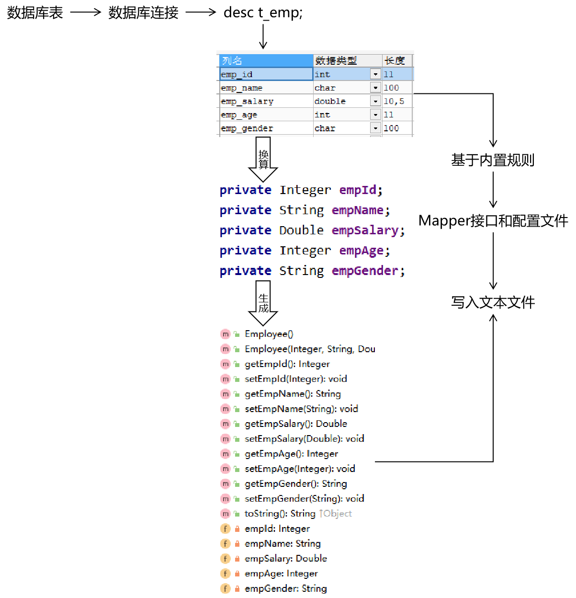
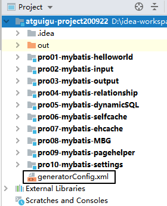
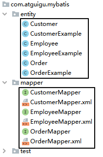
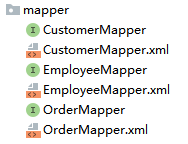

[TOC]

# 一、缓存

理解缓存的工作机制和缓存的用途。

## 1、缓存机制介绍


## 2、一级缓存和二级缓存


查询的顺序是：

- 先查询二级缓存，因为二级缓存中可能会有其他程序已经查出来的数据，可以拿来直接使用。
- 如果二级缓存没有命中，再查询一级缓存
- 如果一级缓存也没有命中，则查询数据库
- SqlSession关闭之前，一级缓存中的数据会写入二级缓存

从范围和作用域角度来说：

- 一级缓存：SqlSession级别
- 二级缓存：SqlSessionFactory级别


它们之间范围的大小参考下面图：


## 3、代码验证一级缓存

```java
@Test
public void testFirstLevelCache() {
    SqlSession session = factory.openSession();

    EmployeeMapper mapper = session.getMapper(EmployeeMapper.class);

    // 1.第一次查询
    Employee employee1 = mapper.selectEmployeeById(2);

    System.out.println("employee1 = " + employee1);

    // 2.第二次查询
    Employee employee2 = mapper.selectEmployeeById(2);

    System.out.println("employee2 = " + employee2);

    // 3.经过验证发现，两次查询返回的其实是同一个对象
    System.out.println("(employee2 == employee1) = " + (employee2 == employee1));
    System.out.println("employee1.equals(employee2) = " + employee1.equals(employee2));
    System.out.println("employee1.hashCode() = " + employee1.hashCode());
    System.out.println("employee2.hashCode() = " + employee2.hashCode());

    session.commit();
    session.close();
}
```

打印结果：

```java
DEBUG 12-01 09:14:48,760 ==>  Preparing: select emp_id,emp_name,emp_salary,emp_gender,emp_age from t_emp where emp_id=?   (BaseJdbcLogger.java:145) 
DEBUG 12-01 09:14:48,804 ==> Parameters: 2(Integer)  (BaseJdbcLogger.java:145) 
DEBUG 12-01 09:14:48,830 <==      Total: 1  (BaseJdbcLogger.java:145) 
employee1 = Employee{empId=2, empName='AAAAAA', empSalary=6666.66, empAge=20, empGender='male'}
employee2 = Employee{empId=2, empName='AAAAAA', empSalary=6666.66, empAge=20, empGender='male'}
(employee2 == employee1) = true
employee1.equals(employee2) = true
employee1.hashCode() = 1131645570
employee2.hashCode() = 1131645570
```

一共只打印了一条SQL语句，两个变量指向同一个对象。

## 4、一级缓存失效的情况

- 不是同一个SqlSession
- 同一个SqlSession但是查询条件发生了变化
- 同一个SqlSession两次查询期间执行了任何一次增删改操作
- 同一个SqlSession两次查询期间手动清空了缓存

## 5、使用二级缓存

这里我们使用的是Mybatis自带的二级缓存。

### ①开启二级缓存功能

在想要使用二级缓存的Mapper配置文件中加入cache标签

```xml
<mapper namespace="com.atguigu.mybatis.EmployeeMapper">

    <!-- 加入cache标签启用二级缓存功能 -->
    <cache/>
```


### ②让实体类支持序列化

```java
public class Employee implements Serializable {
```

### ③junit测试

```java
    @Test
    public void testSecondLevelCacheExists() {
        SqlSession session = factory.openSession();

        EmployeeMapper mapper = session.getMapper(EmployeeMapper.class);

        Employee employee = mapper.selectEmployeeById(2);

        System.out.println("employee = " + employee);

        // 在执行第二次查询前，关闭当前SqlSession
        session.close();

        // 开启一个新的SqlSession
        session = factory.openSession();

        mapper = session.getMapper(EmployeeMapper.class);

        employee = mapper.selectEmployeeById(2);

        System.out.println("employee = " + employee);

        session.close();

    }
```

打印效果：

```java
DEBUG 12-01 09:44:27,057 Cache Hit Ratio [com.atguigu.mybatis.EmployeeMapper]: 0.0  (LoggingCache.java:62) 
DEBUG 12-01 09:44:27,459 ==>  Preparing: select emp_id,emp_name,emp_salary,emp_gender,emp_age from t_emp where emp_id=?   (BaseJdbcLogger.java:145) 
DEBUG 12-01 09:44:27,510 ==> Parameters: 2(Integer)  (BaseJdbcLogger.java:145) 
DEBUG 12-01 09:44:27,536 <==      Total: 1  (BaseJdbcLogger.java:145) 
employee = Employee{empId=2, empName='AAAAAA', empSalary=6666.66, empAge=20, empGender='male'}
DEBUG 12-01 09:44:27,622 Cache Hit Ratio [com.atguigu.mybatis.EmployeeMapper]: 0.5  (LoggingCache.java:62) 
employee = Employee{empId=2, empName='AAAAAA', empSalary=6666.66, empAge=20, empGender='male'}
```

### ④缓存命中率

日志中打印的Cache Hit Ratio叫做缓存命中率

```java
    Cache Hit Ratio [com.atguigu.mybatis.EmployeeMapper]: 0.0（0/1)
    Cache Hit Ratio [com.atguigu.mybatis.EmployeeMapper]: 0.5（1/2）
    Cache Hit Ratio [com.atguigu.mybatis.EmployeeMapper]: 0.6666666666666666（2/3）
    Cache Hit Ratio [com.atguigu.mybatis.EmployeeMapper]: 0.75（3/4）
    Cache Hit Ratio [com.atguigu.mybatis.EmployeeMapper]: 0.8（4/5）
```

缓存命中率=命中缓存的次数/查询的总次数

### ⑤查询结果存入二级缓存的时机

结论：SqlSession关闭的时候，一级缓存中的内容会被存入二级缓存

```java
// 1.开启两个SqlSession
SqlSession session01 = factory.openSession();
SqlSession session02 = factory.openSession();

// 2.获取两个EmployeeMapper
EmployeeMapper employeeMapper01 = session01.getMapper(EmployeeMapper.class);
EmployeeMapper employeeMapper02 = session02.getMapper(EmployeeMapper.class);

// 3.使用两个EmployeeMapper做两次查询，返回两个Employee对象
Employee employee01 = employeeMapper01.selectEmployeeById(2);
Employee employee02 = employeeMapper02.selectEmployeeById(2);

// 4.比较两个Employee对象
System.out.println("employee02.equals(employee01) = " + employee02.equals(employee01));
```

上面代码打印的结果是：

```java
DEBUG 12-01 10:10:32,209 Cache Hit Ratio [com.atguigu.mybatis.EmployeeMapper]: 0.0  (LoggingCache.java:62) 
DEBUG 12-01 10:10:32,570 ==>  Preparing: select emp_id,emp_name,emp_salary,emp_gender,emp_age from t_emp where emp_id=?   (BaseJdbcLogger.java:145) 
DEBUG 12-01 10:10:32,624 ==> Parameters: 2(Integer)  (BaseJdbcLogger.java:145) 
DEBUG 12-01 10:10:32,643 <==      Total: 1  (BaseJdbcLogger.java:145) 
DEBUG 12-01 10:10:32,644 Cache Hit Ratio [com.atguigu.mybatis.EmployeeMapper]: 0.0  (LoggingCache.java:62) 
DEBUG 12-01 10:10:32,661 ==>  Preparing: select emp_id,emp_name,emp_salary,emp_gender,emp_age from t_emp where emp_id=?   (BaseJdbcLogger.java:145) 
DEBUG 12-01 10:10:32,662 ==> Parameters: 2(Integer)  (BaseJdbcLogger.java:145) 
DEBUG 12-01 10:10:32,665 <==      Total: 1  (BaseJdbcLogger.java:145) 
employee02.equals(employee01) = false
```

修改代码：

```java
// 1.开启两个SqlSession
SqlSession session01 = factory.openSession();
SqlSession session02 = factory.openSession();

// 2.获取两个EmployeeMapper
EmployeeMapper employeeMapper01 = session01.getMapper(EmployeeMapper.class);
EmployeeMapper employeeMapper02 = session02.getMapper(EmployeeMapper.class);

// 3.使用两个EmployeeMapper做两次查询，返回两个Employee对象
Employee employee01 = employeeMapper01.selectEmployeeById(2);

// ※第一次查询完成后，把所在的SqlSession关闭，使一级缓存中的数据存入二级缓存
session01.close();
Employee employee02 = employeeMapper02.selectEmployeeById(2);

// 4.比较两个Employee对象
System.out.println("employee02.equals(employee01) = " + employee02.equals(employee01));

// 5.另外一个SqlSession用完正常关闭
session02.close();
```

打印结果：

```java
DEBUG 12-01 10:14:06,804 Cache Hit Ratio [com.atguigu.mybatis.EmployeeMapper]: 0.0  (LoggingCache.java:62) 
DEBUG 12-01 10:14:07,135 ==>  Preparing: select emp_id,emp_name,emp_salary,emp_gender,emp_age from t_emp where emp_id=?   (BaseJdbcLogger.java:145) 
DEBUG 12-01 10:14:07,202 ==> Parameters: 2(Integer)  (BaseJdbcLogger.java:145) 
DEBUG 12-01 10:14:07,224 <==      Total: 1  (BaseJdbcLogger.java:145) 
DEBUG 12-01 10:14:07,308 Cache Hit Ratio [com.atguigu.mybatis.EmployeeMapper]: 0.5  (LoggingCache.java:62) 
employee02.equals(employee01) = false
```


### ⑥二级缓存相关配置

在Mapper配置文件中添加的cache标签可以设置一些属性：

- eviction属性：缓存回收策略

  LRU（Least Recently Used） – 最近最少使用的：移除最长时间不被使用的对象。

  FIFO（First in First out） – 先进先出：按对象进入缓存的顺序来移除它们。

  SOFT – 软引用：移除基于垃圾回收器状态和软引用规则的对象。

  WEAK – 弱引用：更积极地移除基于垃圾收集器状态和弱引用规则的对象。

  默认的是 LRU。

- flushInterval属性：刷新间隔，单位毫秒

  默认情况是不设置，也就是没有刷新间隔，缓存仅仅调用语句时刷新

- size属性：引用数目，正整数

  代表缓存最多可以存储多少个对象，太大容易导致内存溢出

- readOnly属性：只读，true/false

  true：只读缓存；会给所有调用者返回缓存对象的相同实例。因此这些对象不能被修改。这提供了很重要的性能优势。

  false：读写缓存；会返回缓存对象的拷贝（通过序列化）。这会慢一些，但是安全，因此默认是 false。

## 6、Mybatis整合EHCache

EHCache作为第三方专门的缓存产品，相比Mybatis自带的缓存机制更加专业一些。

### ①搭建EHCache使用环境

#### [1]在Mybatis环境基础上加入jar包

- ehcache-core-2.6.8.jar：EHCache核心包
- mybatis-ehcache-1.0.3.jar：Mybatis和EHCache的整合包
- slf4j-api-1.6.1.jar：SFL4J是一个日志标准
- slf4j-log4j12-1.6.2.jar：SFL4J标准下log4j的实现

#### [2]加入配置文件

文件名：ehcache.xml

```xml
<?xml version="1.0" encoding="UTF-8"?>
<ehcache xmlns:xsi="http://www.w3.org/2001/XMLSchema-instance"
         xsi:noNamespaceSchemaLocation="../config/ehcache.xsd">
    <!-- 磁盘保存路径 -->
    <diskStore path="D:\atguigu\ehcache"/>

    <defaultCache
            maxElementsInMemory="1000"
            maxElementsOnDisk="10000000"
            eternal="false"
            overflowToDisk="true"
            timeToIdleSeconds="120"
            timeToLiveSeconds="120"
            diskExpiryThreadIntervalSeconds="120"
            memoryStoreEvictionPolicy="LRU">
    </defaultCache>
</ehcache>
```

> 引入第三方框架或工具时，配置文件的文件名可以自定义吗？
>
> - 可以自定义：文件名是由我告诉其他环境
> - 不能自定义：文件名是框架内置的、约定好的，就不能自定义，以避免框架无法加载这个文件

#### [3]指定缓存管理器的具体类型

在Mapper配置文件的cache标签内设置type属性

```xml
<cache type="org.mybatis.caches.ehcache.EhcacheCache"/>
```

### ②junit测试

正常按照二级缓存的方式测试即可。因为整合EHCache后，其实就是使用EHCache代替了Mybatis自带的二级缓存。

### ③EHCache配置文件说明

> diskStore标签：指定数据在磁盘中的存储位置。
> defaultCache标签：当借助CacheManager.add("demoCache")创建Cache时，EhCache便会采用<defalutCache/>指定的的管理策略
>
> 以下属性是必须的：
> maxElementsInMemory - 在内存中缓存的element的最大数目
> maxElementsOnDisk - 在磁盘上缓存的element的最大数目，若是0表示无穷大
> eternal - 设定缓存的elements是否永远不过期。如果为true，则缓存的数据始终有效，如果为false那么还要根据timeToIdleSeconds，timeToLiveSeconds判断
> overflowToDisk - 设定当内存缓存溢出的时候是否将过期的element缓存到磁盘上
>
> 以下属性是可选的：
> timeToIdleSeconds - 当缓存在EhCache中的数据前后两次访问的时间超过timeToIdleSeconds的属性取值时，这些数据便会删除，默认值是0,也就是可闲置时间无穷大
> timeToLiveSeconds - 缓存element的有效生命期，默认是0.,也就是element存活时间无穷大
> diskSpoolBufferSizeMB 这个参数设置DiskStore(磁盘缓存)的缓存区大小.默认是30MB.每个Cache都应该有自己的一个缓冲区.
> diskPersistent - 在VM重启的时候是否启用磁盘保存EhCache中的数据，默认是false。
> diskExpiryThreadIntervalSeconds - 磁盘缓存的清理线程运行间隔，默认是120秒。每个120s，相应的线程会进行一次EhCache中数据的清理工作
> memoryStoreEvictionPolicy - 当内存缓存达到最大，有新的element加入的时候， 移除缓存中element的策略。默认是LRU（最近最少使用），可选的有LFU（最不常使用）和FIFO（先进先出）

## 7、缓存的基本原理

集中体现在org.apache.ibatis.cache.impl.PerpetualCache类中，内部以Map的形式维护缓存数据的。

现阶段大家重点理解缓存的机制和作用，具体的配置、代码这样的操作层面没有那么重要。

# 二、逆向工程

## 1、概念

- 正向工程：先创建Java实体类，由框架负责根据实体类生成数据库表。Hibernate是支持正向工程的。
- 逆向工程：先创建数据库表，由框架负责根据数据库表，反向生成如下资源：
  - Java实体类
  - Mapper接口
  - Mapper配置文件

## 2、基本原理



## 3、搭建环境

### ①加入jar包

mybatis-generator-core-1.3.2.jar

### ②加入配置文件

```xml
<?xml version="1.0" encoding="UTF-8"?>
<!DOCTYPE generatorConfiguration
        PUBLIC "-//mybatis.org//DTD MyBatis Generator Configuration 1.0//EN"
        "http://mybatis.org/dtd/mybatis-generator-config_1_0.dtd">

<generatorConfiguration>
    <!--
            targetRuntime: 执行生成的逆向工程的版本
                    MyBatis3Simple: 生成基本的CRUD（清新简洁版）
                    MyBatis3: 生成带条件的CRUD（奢华尊享版）
     -->
    <context id="DB2Tables" targetRuntime="MyBatis3">

        <!-- 数据库的连接信息 -->
        <jdbcConnection driverClass="com.mysql.jdbc.Driver"
                        connectionURL="jdbc:mysql://192.168.198.100:3306/mybatis0922"
                        userId="root"
                        password="atguigu">
        </jdbcConnection>

        <!-- javaBean的生成策略-->
        <javaModelGenerator targetPackage="com.atguigu.mybatis.entity" targetProject=".\pro08-mybatis-MBG\src">
            <property name="enableSubPackages" value="true" />
            <property name="trimStrings" value="true" />
        </javaModelGenerator>

        <!-- SQL映射文件的生成策略 -->
        <sqlMapGenerator targetPackage="com.atguigu.mybatis.mapper"  targetProject=".\pro08-mybatis-MBG\src">
            <property name="enableSubPackages" value="true" />
        </sqlMapGenerator>

        <!-- Mapper接口的生成策略 -->
        <javaClientGenerator type="XMLMAPPER" targetPackage="com.atguigu.mybatis.mapper"  targetProject=".\pro08-mybatis-MBG\src">
            <property name="enableSubPackages" value="true" />
        </javaClientGenerator>

        <!-- 逆向分析的表 -->
        <!-- tableName设置为*号，可以对应所有表，此时不写domainObjectName -->
        <!-- domainObjectName属性指定生成出来的实体类的类名 -->
        <table tableName="t_emp" domainObjectName="Employee"/>
        <table tableName="t_customer" domainObjectName="Customer"/>
        <table tableName="t_order" domainObjectName="Order"/>
    </context>
</generatorConfiguration>
```

### ③java代码

```java
List<String> warnings = new ArrayList<String>();
boolean overwrite = true;
File configFile = new File("generatorConfig.xml");
ConfigurationParser cp = new ConfigurationParser(warnings);
Configuration config = cp.parseConfiguration(configFile);
DefaultShellCallback callback = new DefaultShellCallback(overwrite);
MyBatisGenerator myBatisGenerator = new MyBatisGenerator(config,
        callback, warnings);
myBatisGenerator.generate(null);
```

### ④说明

- 为了能让File构造器读取到generatorConfig.xml配置文件，配置文件存放的位置是整个工程的根目录



- 由于上面的原因，配置targetProject属性时需要带上module的名称

```xml
targetProject=".\pro08-mybatis-MBG\src"
```

- 生成的资源包括：



## 4、QBC查询

### ①概念

QBC：Query By Criteria


QBC查询最大的特点就是将SQL语句中的WHERE子句进行了组件化的封装，让我们可以通过调用Criteria对象的方法自由的拼装查询条件。

### ②使用

```java
        // 1.创建EmployeeExample对象
        EmployeeExample example = new EmployeeExample();

        // 2.通过example对象创建Criteria对象
        EmployeeExample.Criteria criteria01 = example.createCriteria();
        EmployeeExample.Criteria criteria02 = example.or();

        // 3.在Criteria对象中封装查询条件
        criteria01
            .andEmpAgeBetween(9, 99)
            .andEmpNameLike("%o%")
            .andEmpGenderEqualTo("male")
            .andEmpSalaryGreaterThan(500.55);

        criteria02
                .andEmpAgeBetween(9, 99)
                .andEmpNameLike("%o%")
                .andEmpGenderEqualTo("male")
                .andEmpSalaryGreaterThan(500.55);

        SqlSession session = factory.openSession();

        EmployeeMapper mapper = session.getMapper(EmployeeMapper.class);

        // 4.基于Criteria对象进行查询
        List<Employee> employeeList = mapper.selectByExample(example);

        for (Employee employee : employeeList) {
            System.out.println("employee = " + employee);
        }

        session.close();

        // 最终SQL的效果：
        // WHERE ( emp_age between ? and ? and emp_name like ? and emp_gender = ? and emp_salary > ? ) or( emp_age between ? and ? and emp_name like ? and emp_gender = ? and emp_salary > ? )
```

## 5、注意

- 将来会使用Maven命令执行生成过程
- 在实际开发中，建议把MBG本身和项目主体代码分开：不要放在同一个工程或模块内

# 三、分页插件：PageHelper

## 1、简介

中国程序员开发的一个专门实现分页效果的Mybatis插件。GitHub网址：

```http
https://github.com/pagehelper
```

码云网址：

```http
https://gitee.com/free/Mybatis_PageHelper
```

## 2、搭建环境

### ①导入jar包

- jsqlparser-0.9.5.jar
- pagehelper-5.0.0.jar

### ②配置PageHelper插件

在Mybatis全局配置文件中配置：

```xml
<plugins>
    <!-- 指定执行分页功能的PageHellper插件 -->
    <plugin interceptor="com.github.pagehelper.PageInterceptor">
        <!-- 设置PageHelper对页码进行自动修正。正确的页码范围：1~总页数 -->
        <property name="reasonable" value="true"/>
    </plugin>
</plugins>
```

### ③Java代码

```java
int pageNum = 1000;
int pageSize = 5;

// 调用静态方法，设定pageNum和pageSize，这样PageHelper插件就可以执行分页了
PageHelper.startPage(pageNum, pageSize);

// 这里返回的List类型本质上是：com.github.pagehelper.Page类
List<Employee> employees = employeeMapper.selectAll();
```

### ④PageInfo

```java
// 为了页面上更容易的解析Page类封装的数据，建议把Page类进一步封装为PageInfo
PageInfo<Employee> pageInfo = new PageInfo<>(employees);
long total = pageInfo.getTotal();
int pages = pageInfo.getPages();
System.out.println("total = " + total);
System.out.println("pages = " + pages);
```

# 四、全局配置文件补充说明

## 1、类型的别名

Mybatis全局配置文件：

```xml
<!-- 配置类型的别名 -->
<typeAliases>
    <!-- 声明了实体类所在的包之后，在Mapper配置文件中，只需要指定这个包下的简单类名即可 -->
    <package name="com.atguigu.mybatis.entity"/>
</typeAliases>
```

Mapper配置文件：

```xml
<!-- Employee selectEmployeeById(Integer empId); -->
<select id="selectEmployeeById" resultType="Employee">
    select emp_id,emp_name,emp_salary,emp_gender,emp_age from t_emp
    where emp_id=#{empId}
</select>
```

## 2、自定义类型转换器

### ①创建自定义类型转换器类

```java
@MappedTypes(value = Address.class)
@MappedJdbcTypes(JdbcType.CHAR)
public class AddressTypeHandler extends BaseTypeHandler<Address> {
    @Override
    public void setNonNullParameter(PreparedStatement preparedStatement, int i, Address address, JdbcType jdbcType) throws SQLException {

    }

    @Override
    public Address getNullableResult(ResultSet resultSet, String columnName) throws SQLException {

        // 1.从结果集中获取原始的地址数据
        String addressOriginalValue = resultSet.getString(columnName);

        // 2.判断原始数据是否有效
        if (addressOriginalValue == null || "".equals(addressOriginalValue))
            return null;

        // 3.如果原始数据有效则执行拆分
        String[] split = addressOriginalValue.split(",");
        String province = split[0];
        String city = split[1];
        String street = split[2];

        // 4.创建Address对象
        Address address = new Address();
        address.setCity(city);
        address.setProvince(province);
        address.setStreet(street);

        return address;
    }

    @Override
    public Address getNullableResult(ResultSet resultSet, int i) throws SQLException {
        return null;
    }

    @Override
    public Address getNullableResult(CallableStatement callableStatement, int i) throws SQLException {
        return null;
    }
}
```

### ②注册自定义类型转换器

在Mybatis全局配置文件中配置：

```xml
<!-- 注册自定义类型转换器 -->
<typeHandlers>
    <typeHandler jdbcType="CHAR" javaType="com.atguigu.mybatis.entity.Address" handler="com.atguigu.mybatis.type.handler.AddressTypeHandler"/>
</typeHandlers>
```

## 3、mapper映射文件注册

Mybatis允许在指定Mapper映射文件时，只指定其所在的包：

```xml
<mappers>
		<package name="com.atguigu.mybatis.dao"/>
</mappers>
```

但是，要求是：

- Mapper接口和Mapper配置文件名称一致
- Mapper配置文件放在Mapper接口所在的包内



# 五、Mybatis底层对JDBC的调用

org.apache.ibatis.executor.statement.PreparedStatementHandler类：


查找上面目标时，Debug查看源码的切入点是：

org.apache.ibatis.session.defaults.DefaultSqlSession类的update()方法


# 六、小结

## 1、重要性等级

- 搭建环境★★★★★
- 数据输入★★★★★
- 数据输出★★★★★
- 关联关系★★★★☆
- 动态SQL★★★☆☆
- 缓存★★☆☆☆
- 逆向工程★★★☆☆
- pagehelper★★★☆☆
- 全局配置文件的其他配置★☆☆☆☆

## 2、Mybatis总体技术体系

