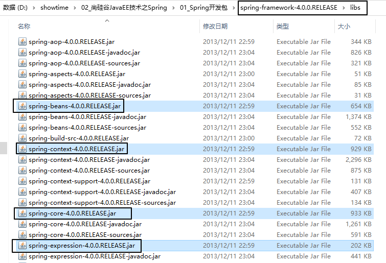
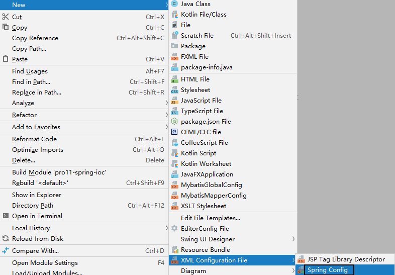
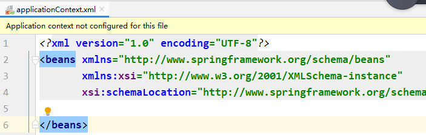
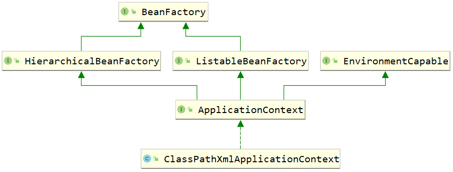
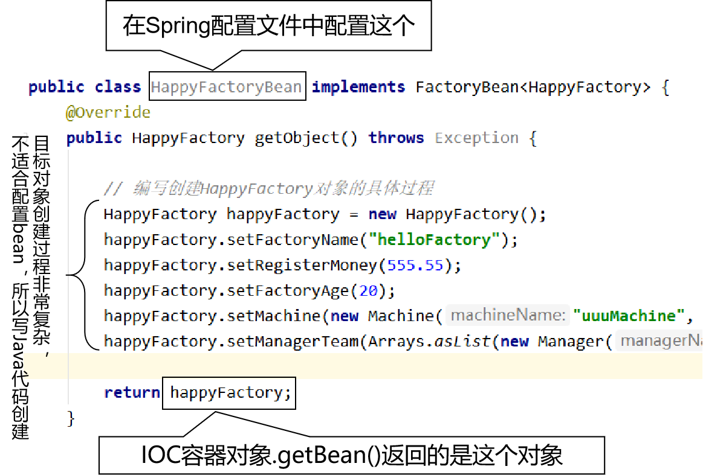

[TOC]

# 一、Spring概述

## 1、Spring的学习内容

- IOC容器
- AOP面向切面编程
- JdbcTemplate
- 声明式事务

## 2、IOC

### ①IOC容器作用

管理组件。

### ②组件

组件是组成项目的模块；

组件也是一种对象；

组件内部包含很多颗粒度更小的对象。

项目：类比一个工厂。

组件：类比工厂中的车间。

对象：组成车间中机器的零件。

#### [1]程序员开发的组件

- JavaWeb阶段
  - 表述层：Servlet对象
  - 业务逻辑层：Service对象
  - 持久化层：Dao对象
- SSM阶段
  - 表述层：Controller或Handler对象
  - 业务逻辑层：Service对象
  - 持久化层：Dao或Mapper对象

#### [2]框架的组件

- SqlSessionFactory：将来把创建这个对象的任务交给Spring来完成，我们只需要告诉Spring：Mybatis全局配置文件在哪，具体创建过程的细节就不需要我们过问了。
- SqlSession
- DruidDataSource

提前看看未来的代码：

```java
@Controller
public class EmpController {

	@Autowired
	private EmpService empService;
	
	@RequestMapping("/get/emp/list")
	public String getEmpList(Model model){
		
		List<Employee> list = empService.getEmpList();
		
		model.addObject("list",list);
		
		return "emp/list";
	}

}

----------------------------------------------
@Service
public class EmpService {

	@Autowired
	private EmpMapper empMapper;
	
	public List<Employee> getEmpList(){
		return empMapper.selectEmpList();
	}

}

-----------------------------------
public interface EmpMapper {

	List<Employee> selectEmpList();

}
```

### ③IOC对组件的管理

- 创建对象
- 初始化
- 给对象中的属性赋值
  - 常规的简单的数据，例如：500、"tom"、30.66、true
  - 其他的组件
- 释放对象前执行清理工作

# 二、IOC/DI

## 1、概念

### ①IOC

Inversion of control：反转控制。

- IOC本身是一个思想
- IOC容器是Spring对IOC思想的具体落地实现

>  “天上飞的理念，地上跑的实现”

通过吃饭的例子来说明“反转控制”：

- 自己做饭：需要自己买菜、洗菜、择菜、炒菜、蒸饭……所有细节都需要自己亲自参与——自己<span style="color:blue;font-weight:bold;">主动</span>向环境索取资源，并参与创建资源的详细过程。
- 回家吃饭：妈妈把饭做好，送到你嘴里——我们<span style="color:blue;font-weight:bold;">被动</span>的享受环境把资源注入给我们，我们不需要参与、过问资源创建的过程、细节。

### ②DI

Dependcy Injection：依赖注入。

- 我们负责明确表达自己需要什么资源。例如：EmpService需要EmpMapper
- 容器负责把我们需要的资源准备好，注入给我们。例如：容器把EmpMapper准备好，设置到EmpService对象中。

DI是IOC的最经典的实现；过了这么多年，我们发现IOC基本上也没有别的实现，所以现在对IOC和DI不做严格区分，可以认为IOC和DI是等同的。

## 2、IOC容器基本操作

从使用者的角度来说，IOC容器包括下面几个基本操作

- 准备好IOC容器对应的配置文件
- 创建IOC容器对象本身
- 把我们开发的组件交给IOC容器管理（让IOC容器替我们创建对象）
- 让IOC容器给我们的对象设置属性
  - 常规的简单数据：500、"tom"、30.66、true
  - 其他组件对象：EmpService里面设置EmpMapper，以后我们管这个操作叫“装配”
- 从容器中获取我们需要使用的对象

## 3、HelloWorld

### ①引入jar包




### ②创建Spring配置文件





### ③配置Spring的配置文件

在Spring配置文件中指定需要IOC容器替我们创建的对象，并设置属性

#### [1]创建一个需要IOC容器创建对象的类

```java
public class HappyFactory {

    private String factoryName;
    private Double registerMoney;
    private Integer factoryAge;
```

#### [2]在Spring配置文件中配置上面的类

```xml
<!-- 通过配置bean标签，告诉Spring的IOC容器创建HappyFactory的对象 -->
<!-- id属性：指定将来创建好的对象的唯一标识 -->
<!-- class属性：指定要创建对象的类的全类名 -->
<bean id="happyFactory" class="com.atguigu.spring.component.HappyFactory">
    <!-- 通过配置property标签给对象设置属性 -->
    <property name="factoryName" value="dreamFactory"/>
    <property name="factoryAge" value="20"/>
    <property name="registerMoney" value="500"/>
</bean>
```


### ④Java代码

```java
public class SpringTest {

    // 读取Spring配置文件，创建IOC容器对象
    private ApplicationContext iocContainer =
            new ClassPathXmlApplicationContext("applicationContext.xml");

    @Test
    public void helloWorld() {

        // 从IOC容器对象中获取已配置的bean
        Object happyFactory = iocContainer.getBean("happyFactory");

        System.out.println("happyFactory = " + happyFactory);

    }
}
```

# 三、IOC实验

## 1、实验一

Debug查看对象的属性是如何设置进去的

- 结论1：创建HappyFactory对象并设置属性值是发生在IOC容器对象创建的过程中，而不是getBean()的时候。
- 结论2：Spring IOC容器内部使用BeanFactory创建bean的对象，对外提供ApplicationContext给开发者使用。
- 结论3：<span style="color:blue;font-weight:bold;">bean的属性通过setXxx()方法注入到bean对象中</span>。



## 2、实验二[重要]

根据类型获取bean

```java
@Test
public void testGetBeanByType() {

    // 根据类型获取bean对象
    HappyFactory factory = iocContainer.getBean(HappyFactory.class);

    System.out.println("factory = " + factory);

}
```

此时如果同样类型的bean在IOC容器中不只一个对象，那么会抛出下面异常：

```java
org.springframework.beans.factory.NoUniqueBeanDefinitionException: No qualifying bean of type [com.atguigu.spring.component.HappyFactory] is defined: expected single matching bean but found 2: happyFactory,happyFactory2
```

## 3、实验三

使用构造器给属性赋值。这个配置方式我们自己几乎不用，能看懂就行。

```xml
<!-- 通过构造器给bean的属性赋值 -->
<bean id="happyFactory3" class="com.atguigu.spring.component.HappyFactory">
    <!-- 通过constructor-arg标签给构造器传入参数 -->
    <constructor-arg value="goodFactory"/>
    <constructor-arg value="8877.66"/>
    <constructor-arg value="99"/>
</bean>
<bean id="happyFactory4" class="com.atguigu.spring.component.HappyFactory">
    <!-- 通过constructor-arg标签给构造器传入参数 -->
    <constructor-arg value="66" index="2"/>
    <constructor-arg value="5544.33" index="1"/>
    <constructor-arg value="helloFactory" index="0"/>
</bean>
```

## 4、实验四

使用p名称空间给属性赋值

```xml
<!-- 使用p名称空间给bean的属性赋值 -->
<bean
    id="happyFactory5"
    class="com.atguigu.spring.component.HappyFactory"
    p:factoryName="appleFactory"
    p:factoryAge="33"
    p:registerMoney="666.66"
/>
```

## 5、实验五

null值和级联属性

```xml
<!-- 给属性设置不同的值 -->
<bean id="happyFactory6" class="com.atguigu.spring.component.HappyFactory">
    <!-- 通过配置property标签给对象设置属性 -->
    <property name="factoryName">
        <!-- 使用null标签设置一个null值 -->
        <null/>
    </property>
    <property name="factoryAge" value="20"/>
    <property name="registerMoney" value="500"/>

    <!-- 给级联属性赋值之前，必须先让级联的属性有一个具体的对象（当然，这样不是我们希望的） -->
    <property name="machine" ref="machine"/>

    <!-- 给级联属性赋值 -->
    <property name="machine.machineName" value="iceCreamMachine"/>
    <property name="machine.machinePrice" value="50.50"/>
</bean>

<bean id="machine" class="com.atguigu.spring.component.Machine"/>
```

## 6、实验六[重要]

给属性赋值的时候，引用另外一个bean。（这个实验中配置的方式是符合Spring使用习惯的）

```xml
<!-- 在给属性设置值的时候引用另外一个bean -->
<!-- 配置machine -->
<bean id="machine2" class="com.atguigu.spring.component.Machine">
    <property name="machineName" value="bananaMachine"/>
    <property name="machinePrice" value="555.66"/>
</bean>

<!-- 配置HappyFactory -->
<bean id="happyFactory7" class="com.atguigu.spring.component.HappyFactory">
    <property name="factoryName" value="bananaFactory"/>
    <property name="factoryAge" value="33"/>

    <!-- value属性指定的都是字面量 -->
    <property name="registerMoney" value="33.44"/>

    <!-- ref属性指定的是另一个bean的id，如果不小心把ref属性写成了value属性，那么Spring不会把value的值看成是一个bean的id，而就是一个普通的字符串，赋值的时候很可能会出错 -->
    <property name="machine" ref="machine2" />
</bean>
```

## 7、实验七[比较重要]

```xml
<!-- 以内部bean的形式给Machine属性赋值 -->
<bean id="happyFactory8" class="com.atguigu.spring.component.HappyFactory">
    <property name="factoryName" value="bananaFactory"/>
    <property name="factoryAge" value="33"/>
    <property name="registerMoney" value="33.44"/>

    <property name="machine">
        <!-- 内部bean仅限于当前位置使用，外部无法使用，所以可以不用写id属性 -->
        <bean class="com.atguigu.spring.component.Machine">
            <property name="machineName" value="catMachine"/>
            <property name="machinePrice" value="66.33"/>
        </bean>
    </property>

</bean>
```

## 8、实验八集合属性

```xml
<!-- 配置集合属性 -->
<bean id="happyFactory9" class="com.atguigu.spring.component.HappyFactory">
    <property name="factoryName" value="bananaFactory"/>
    <property name="factoryAge" value="33"/>
    <property name="registerMoney" value="33.44"/>

    <!-- 给集合属性赋值 -->
    <property name="productLineList">
        <list>
            <!-- 给集合属性填充值的时候可以使用内部bean的形式或通过ref标签引用另一个外部bean -->
            <bean class="com.atguigu.spring.component.ProductLine">
                <property name="productName" value="lineOne"/>
            </bean>
            <bean class="com.atguigu.spring.component.ProductLine">
                <property name="productName" value="lineTwo"/>
            </bean>
            <bean class="com.atguigu.spring.component.ProductLine">
                <property name="productName" value="lineThree"/>
            </bean>
            <ref bean="productLine"/>
        </list>
    </property>

</bean>

<bean id="productLine" class="com.atguigu.spring.component.ProductLine">
    <property name="productName" value="lineFour"/>
</bean>
```

## 9、实验九集合类型的bean

```xml
<!-- 直接配置集合类型 -->
<util:list id="managerTeamId">
    <bean class="com.atguigu.spring.component.Manager">
        <property name="managerName" value="tom"/>
        <property name="managerSalary" value="500.500"/>
    </bean>
    <bean class="com.atguigu.spring.component.Manager">
        <property name="managerName" value="jerry"/>
        <property name="managerSalary" value="600.500"/>
    </bean>
    <bean class="com.atguigu.spring.component.Manager">
        <property name="managerName" value="bob"/>
        <property name="managerSalary" value="700.500"/>
    </bean>
</util:list>

<bean id="happyFactory10" class="com.atguigu.spring.component.HappyFactory">
    <!-- 引用外部集合类型 -->
    <property name="managerTeam" ref="managerTeamId"/>
</bean>
```

## 10、实验十FactoryBean[比较重要]

学习这个接口是为了理解Spring整合其他第三方框架时采取的策略。

### ①FactoryBean接口说明

```java
package org.springframework.beans.factory;

// 如果我们在Spring的配置文件中配置FactoryBean类型的bean
// 实际从IOC容器中获取这个bean对应的对象时，实际拿到的是getObject()返回的对象
// 泛型T指定的就是当前这个“工厂”要生产的bean，我们要让这个“工厂”生产什么产品，这里的T就写什么类型
public interface FactoryBean<T> {
    // 工厂生产出来的产品对象，也是从IOC容器中真正获取到的那个对象
    T getObject() throws Exception;

    // 产品对象的类型
    Class<?> getObjectType();

    // 工厂生产的产品对象是否是单一实例的
    boolean isSingleton();
}
```

举例：Spring整合Mybatis时，配置的是SqlSessionFactoryBean，但是获取到的实际的对象是SqlSessionFactory。SqlSessionFactoryBean就实现了FactoryBean接口。



所以，FactoryBean形式适用于整合第三方框架时，去创建复杂的核心对象。

### ②创建FactoryBean

```java
public class HappyFactoryBean implements FactoryBean<HappyFactory> {
    // 提供了getXxx()、setXxx()方法的成员变量，可以在配置bean的时候指定具体值
    private String factoryName;

    public String getFactoryName() {
        return factoryName;
    }

    public void setFactoryName(String factoryName) {
        this.factoryName = factoryName;
    }
    @Override
    public HappyFactory getObject() throws Exception {

        // 编写创建HappyFactory对象的具体过程
        HappyFactory happyFactory = new HappyFactory();
        happyFactory.setFactoryName(factoryName);
        happyFactory.setRegisterMoney(555.55);
        happyFactory.setFactoryAge(20);
        happyFactory.setMachine(new Machine("uuuMachine", 555.22));
        happyFactory.setManagerTeam(Arrays.asList(new Manager("tom",55.22),new Manager("jerry",66.33)));

        return happyFactory;
    }

    @Override
    public Class<?> getObjectType() {
        return HappyFactory.class;
    }

    @Override
    public boolean isSingleton() {
        return true;
    }
}
```

### ③配置FactoryBean

```xml
<!-- 在class属性配置的是HappyFactoryBean -->
<!-- 这个bean在IOC容器中真正创建的对象是HappyFactory -->
<bean id="happyFactory11" class="com.atguigu.spring.component.HappyFactoryBean">
    <property name="factoryName" value="haoziweizhi"/>
</bean>
```

## 11、实验十一[比较重要]

测试bean的作用域

```xml
<!-- 按照默认作用域配置manager -->
<bean id="managerSingleton" class="com.atguigu.spring.component.Manager">
    <property name="managerName" value="justin"/>
    <property name="managerSalary" value="5000.55"/>
</bean>

<!-- 通过scope属性将bean设置为多实例 -->
<bean id="managerPrototype" scope="prototype" class="com.atguigu.spring.component.Manager">
    <property name="managerName" value="justin"/>
    <property name="managerSalary" value="5000.55"/>
</bean>
```

junit测试：

```java
@Test
public void testScope() {
    Object managerSingleton01 = iocContainer.getBean("managerSingleton");
    Object managerSingleton02 = iocContainer.getBean("managerSingleton");

    System.out.println("managerSingleton01.hashCode() = " + managerSingleton01.hashCode());
    System.out.println("managerSingleton02.hashCode() = " + managerSingleton02.hashCode());

    // 打印结果如下：证明是同一个对象，说明bean默认是单例的
//        managerSingleton01.hashCode() = 265119009
//        managerSingleton02.hashCode() = 265119009

    Object managerPrototype01 = iocContainer.getBean("managerPrototype");
    Object managerPrototype02 = iocContainer.getBean("managerPrototype");

    System.out.println("managerPrototype01.hashCode() = " + managerPrototype01.hashCode());
    System.out.println("managerPrototype02.hashCode() = " + managerPrototype02.hashCode());
}
```

通过debug跟踪源码，发现：

- scope属性为singleton时：bean的实例对象在IOC容器初始化时创建
- scope属性为prototype时：bean的实例对象在调用getBean()方法时创建

实用价值：将来在SpringMVC中，使用Controller类处理请求，此时有个问题——SpringMVC会不会为每一个请求单独创建一个Controller对象？基于默认值配置，Controller对象也是单实例的。所以不要在处理请求的过程中修改Controller的成员变量——会有线程安全问题。

## 12、实验十二bean的后置处理器[应付面试]

### ①创建后置处理器类

```java
public class MyBeanPostProcessor implements BeanPostProcessor {
    @Override
    public Object postProcessBeforeInitialization(
            // bean是被处理的对象
            Object bean,
            // beanName是被处理对象的bean的id
            String beanName) throws BeansException {

        System.out.println("Before bean = " + bean);
        System.out.println("Before beanName = " + beanName);

        // 这里要把经过处理的bean返回
        return bean;
    }

    @Override
    public Object postProcessAfterInitialization(Object bean, String beanName) throws BeansException {

        System.out.println("After bean = " + bean);
        System.out.println("After beanName = " + beanName);

        return bean;
    }
}
```

### ②注册后置处理器类

```xml
<bean id="myBeanPostProcessor" class="com.atguigu.spring.component.MyBeanPostProcessor"/>
```

### ③执行的时机

- postProcessBeforeInitialization()：在初始化操作前
- postProcessAfterInitialization()：在初始化操作后

## 13、实验十三bean的初始化方法和销毁方法[应付面试]

### ①在bean所属的Java类中创建初始化方法和销毁方法

```java
// 对象创建好之后执行初始化操作
public void doInit() {
    System.out.println("小孩儿刚生下来要洗澡");
}

// 对象销毁前执行清理操作
public void doDestroy() {
    System.out.println("告别之前留几句话");
}
```

### ②配置bean时指定初始化方法和销毁方法

```xml
<!-- 配置bean的初始化方法和销毁方法 -->
<bean id="managerInitAndDestroy"
      init-method="doInit"
      destroy-method="doDestroy"
      class="com.atguigu.spring.component.Manager"></bean>
```

### ③junit测试

```java
@Test
public void testBeanLifeCycle() {
    Object managerInitAndDestroy = iocContainer.getBean("managerInitAndDestroy");
    System.out.println("managerInitAndDestroy = " + managerInitAndDestroy);
    ((ClassPathXmlApplicationContext)iocContainer).close();
}
```

打印效果：

```java
Manager constructor
Before bean = Manager{managerName='null', managerSalary=null}
Before beanName = managerInitAndDestroy
小孩儿刚生下来要洗澡
After bean = Manager{managerName='null', managerSalary=null}
After beanName = managerInitAndDestroy
managerInitAndDestroy = Manager{managerName='null', managerSalary=null}
十二月 02, 2020 4:43:54 下午 org.springframework.context.support.ClassPathXmlApplicationContext doClose
信息: Closing org.springframework.context.support.ClassPathXmlApplicationContext@4141d797: startup date [Wed Dec 02 16:43:54 CST 2020]; root of context hierarchy
告别之前留几句话
```

### ④bean的生命周期

- 创建bean的对象
- 设置bean的属性
- 调用bean后置处理器的before方法（如果有的话）
- 调用bean的初始化方法（如果有的话）
- 调用bean后置处理器的after方法（如果有的话）
- bean可用
- 调用bean的销毁方法（如果有的话）
- 关闭IOC容器

## 14、实验十四引用外部属性文件[重要]

### ①准备外部属性文件

```properties
wechat.dev.driver=com.mysql.jdbc.Driver
wechat.dev.url=jdbc:mysql://192.168.198.100:3306/mybatis1026
wechat.dev.username=root
wechat.dev.password=atguigu
```

### ②在Spring配置文件中引入外部属性文件

```xml
<context:property-placeholder location="classpath:jdbc.properties"/>
```

### ③基于外部属性文件配置数据源

```xml
<bean id="dataSource" class="com.alibaba.druid.pool.DruidDataSource">
    <property name="driverClassName" value="${wechat.dev.driver}"/>
    <property name="url" value="${wechat.dev.url}"/>
    <property name="username" value="${wechat.dev.username}"/>
    <property name="password" value="${wechat.dev.password}"/>
</bean>
```

### ④junit测试

```java
@Test
public void testDBConnection() throws SQLException {
    DataSource dataSource = iocContainer.getBean(DataSource.class);
    Connection connection = dataSource.getConnection();
    System.out.println("connection = " + connection);
}
```

打印结果：connection = com.mysql.jdbc.JDBC4Connection@3745e5c6

## 15、实验十五基于XML的自动装配

### ①概念


自动装配：在IOC容器中，组件A需要组件B；同时组件B在IOC容器中也正好存在，IOC容器替我们自动把这两个组件组装好。

组装：


### ②实现方式

```xml
<!-- 配置EmpDao对应的bean -->
<bean id="empDao3" class="com.atguigu.spring.component.EmpDao"/>
<bean id="empDao2" class="com.atguigu.spring.component.EmpDao"/>

<!-- 配置EmpService，并在EmpService中自动装配EmpDao -->
<!-- 使用autowire属性配置自动装配 -->
<!-- autowire="byType"：根据所需要的类型，到IOC容器中查找符合这个类型的bean。此时要求目标bean必须是单实例的。 -->
<!-- autowire="byName"：根据bean的id进行装配。装配的规则是：需要装配的属性的属性明和目标bean的id一致。 -->
<bean id="empService"
      class="com.atguigu.spring.component.EmpService"
      autowire="byName"/>

<!-- 手动装配 -->
<!--<bean id="empService" class="com.atguigu.spring.component.EmpService">
    <property name="empDao" ref="empDao"/>
</bean>-->
```

## 16、实验十六通过注解配置bean[重要]

### ①组件相关的注解

- @Component：组件

  应用场景：这个类确实需要加入IOC容器，但是又不是下面典型的三种情况

- @Controller：控制器

- @Service：对应业务逻辑层的Service类

- @Repository：对应持久化层的Dao或Mapper

从程序运行的角度来说，上面四个注解的作用是一样的，即使标记在了不对应的类上，Spring在运行过程中也不会报错。但是为了我们自己开发过程中不造成不必要的误解，我们还是要标记在正确的类上。

### ②在类上标记注解

```java
@Controller
public class EmpController {
}
```

```java
@Service
public class EmpService {
}
```

```java
@Repository
public class EmpDao {
}
```

但是仅仅把注解标记在类上，还不足以让IOC容器创建它们的对象。

> 初学者的误区：
>
> 认为注解对应的功能都是在注解的代码里写的。但其实并没有。
>
> 例如：@Controller注解代码

```java
@Target({ElementType.TYPE})
@Retention(RetentionPolicy.RUNTIME)
@Documented
@Component
public @interface Controller {
    String value() default "";
}
```

> @Controller注解的代码中其实有效的就是声明了一个value属性。
>
> 注解本身和它里面可以设置的属性一起告诉框架，我们在标记了注解的这个地方要干嘛。
>
> 具体干活还是框架去干。
>
> 但是框架怎么知道这有个注解？
>
> 答案是：扫描。

### ③配置自动扫描的包

加入spring-aop-4.0.0.RELEASE.jar包。

```xml
<context:component-scan base-package="com.atguigu.spring.component"/>
```

### ④junit测试

```java
private ApplicationContext iocContainer = new ClassPathXmlApplicationContext("applicationContext.xml");

@Test
public void testGetAnnotationBean() {
    EmpController empController = iocContainer.getBean(EmpController.class);
    EmpService empService = iocContainer.getBean(EmpService.class);
    EmpDao empDao = iocContainer.getBean(EmpDao.class);

    System.out.println("empController = " + empController);
    System.out.println("empService = " + empService);
    System.out.println("empDao = " + empDao);
}
```

### ⑤bean的id

#### [1]默认情况

使用上面注解将类加入IOC容器后，bean的id是类名首字母小写。例如：下面代码中，这个类在IOC容器中的bean的id是taskServiceSimpleImpl

```java
@Service
public class TaskServiceSimpleImpl implements TaskService {
}
```

#### [2]指定bean的id

```java
@Service(value = "zhutou")
public class TaskServiceSimpleImpl implements TaskService {
}
```

或

```java
@Service("zhutou")
public class TaskServiceSimpleImpl implements TaskService {
}
```

### ⑥bean的范围

和基于XML的情况一样，通过注解加入IOC容器的bean，默认是单一实例的。如果使用@Scope(value = "prototype")设置为多实例对象，那么每次getBean()会创建新的对象

```java
// 使用@Scope注解可以指定bean是单一实例还是多实例
@Scope(value = "prototype")

// 使用value属性可以指定bean的id
@Controller(value = "fengLaoShiZhenShuai")
public class EmpController {
}
```


## 17、实验十七通过注解自动装配

### ①使用@Autowired注解的基本情况[重要]

下面的代码是最基本的用法，但是以后我们用的就是这个最基本的用法。

```java
@Controller
public class EmpController {

    @Autowired
    private EmpService empService;

    public String getMessage() {
        return empService.getMessage();
    }

}
```

```java
@Service
public class EmpService {

    @Autowired
    private EmpDao empDao;

    public String getMessage() {
        return empDao.selectMessage();
    }
}
```

### ②新旧代码对比

```java
public class EmpServlet extends BaseServlet {

	private EmpService empService = new EmpService();

}

----------------华丽的分割线------------------

@Controller
public class EmpController {

	@Autowired
	private EmpService empService;

}
```

## 18、实验十八扫描包相关特殊情况

### ①扫描多个包可以使用逗号分开

```xml
<context:component-scan 
      base-package="com.atguigu.spring.component,com.atguigu.spring.toy"/>
```

### ②使用resource-pattern属性进行过滤

此时只有符合条件的类会被扫描

```java
<!-- 配置自动扫描的包 -->
<context:component-scan
    base-package="com.atguigu.spring.component,com.atguigu.spring.toy"
    resource-pattern="Shop*.class"
/>
```

### ③排除特定类

```xml
<!-- 特殊情况3：在base-package基础上排除掉一些类 -->
<context:component-scan base-package="com.atguigu.spring.component">
    <!-- 使用context:exclude-filter标签配置排除一些类的规则 -->
    <!-- type="annotation"表示排除标记了特定注解的类 -->
    <!-- expression本身是表达式的意思，如果type属性指定的规则是annotation，那么这里配置特定注解的全类名 -->
    <context:exclude-filter
            type="annotation"
            expression="org.springframework.stereotype.Controller"/>
</context:component-scan>
```

### ④仅扫描特定类

```xml
<!-- 特殊情况4：在base-package基础上“仅”扫描某些类 -->
<!-- 配置context:include-filter标签还不足以实现“仅”的效果 -->
<!-- 还必须配置use-default-filters="false"让默认扫描规则失效 -->
<context:component-scan
        base-package="com.atguigu.spring.component"
        use-default-filters="false"
    >

    <!-- 使用context:include-filter标签配置在base-package基础上要包含到扫描规则中的特定规则 -->
    <context:include-filter
            type="annotation"
            expression="org.springframework.stereotype.Repository"/>
</context:component-scan>
```

## 19、实验十九自动装配特殊情况

### ①可以加@Autowired注解的位置

```java
@Controller
public class EmpController {

    @Autowired
    private EmpService empService;
    
    @Autowired
    public EmpController(EmpService empService) {
        System.out.println("EmpController构造器中：empService = " + empService);
    }

    @Autowired
    public void setEmpService(EmpService empService) {
        System.out.println("EmpController的set方法中：empService = " + empService);
    }
```

### ②@Autowired注解设置required属性

required属性可选值：

- true：表示当前位置必须注入成功，否则会抛出装配失败的异常
- false：不是必须装配，允许装配不成功

```java
    // 默认情况下@Autowired要求必须装配成功，如果目标bean找不到会抛出异常
    // 如果目标bean可有可无，不装配也行，那么可以设置required = false
    @Autowired(required = false)
    private DeptService deptService;
```

但是实际开发时，但凡是写了@Autowired注解，那就肯定是需要装配成功的。

### ③@Autowired注解查找目标bean的顺序

- 第一步：根据类型查找
- 第二步：如果根据类型找到的是多个，那么根据变量名或方法名作为bean的id继续查找

上面两种方式都找不到会抛出异常

### ④@Qualifier注解

帮助@Autowired注解指定目标bean的名称

```java
    @Autowired
    // 使用@Qualifier注解指定目标bean的id
    @Qualifier(value = "zhutou")
    private TaskService taskServiceSimpleImpl;
```