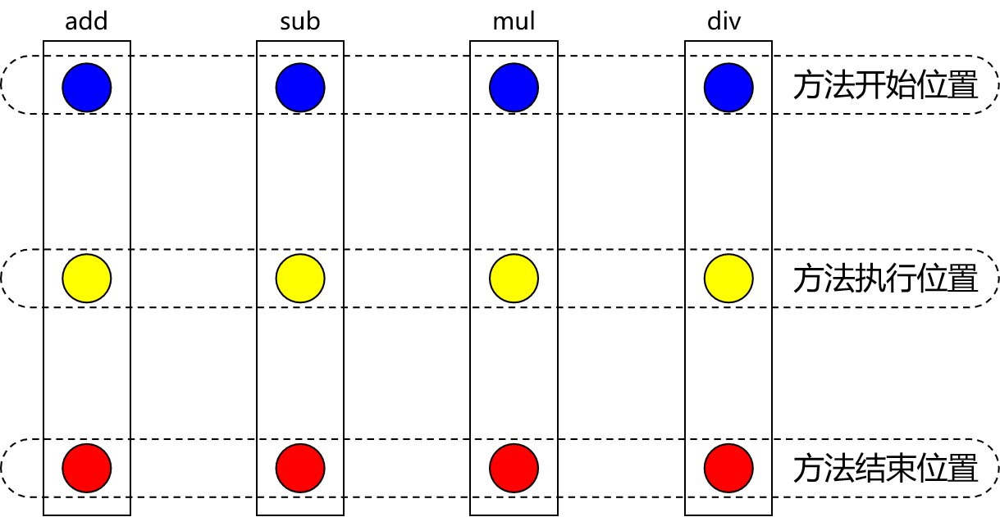
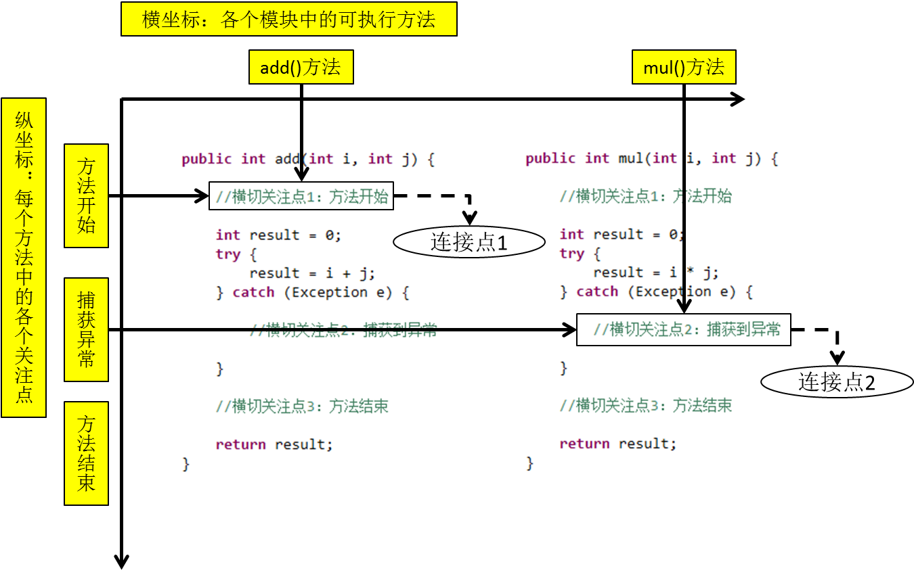
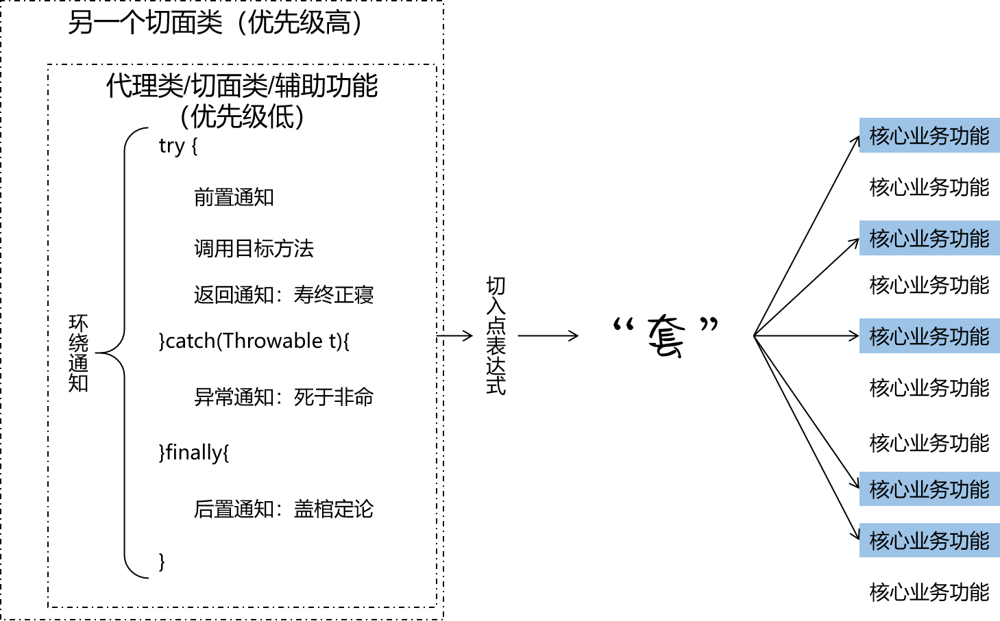

[TOC]

# 一、IOC回顾

http://naotu.baidu.com/file/41366f6b24e314fa5062ca742d920b02?token=78d4975c76ee2f29

# 二、AOP前奏

## 1、概念

AOP：Aspect Oriented Programming面向切面编程

| 面向对象编程                       | 面向接口编程           | 面向切面编程                                 |
| ---------------------------------- | ---------------------- | -------------------------------------------- |
| 简化代码：把重复代码纵向抽取到父类 | 解耦：不同组件之间解耦 | 简化代码：把方法中的重复代码横向抽取到切面中 |

## 2、作用

下面我们从两个方向来介绍AOP的作用。下面这两个方向是同一件事用两种不同方式表达，它们是“一个硬币的两面”。

简化代码：如果在项目中，有一系列方法都包含相同的、重复的代码，使用AOP就可以将这些代码抽取出来，从而实现代码的简化。

代码增强：使用抽取出来、封装好的代理类去“套用”到目标方法上，就是对目标方法的代码增强。

## 3、举例说明

### ①原始代码


### ②附加功能


这样附加功能后，代码存在明显的问题：

- 代码会变得非常臃肿
- 核心逻辑的代码和非核心逻辑的代码混杂在一起，不利于开发和维护
- 将来不管是核心代码还是非核心代码想要升级或调试bug，都非常不便

### ③抽取重复逻辑，简化代码


抽取出来之后，代理类中的非核心逻辑和目标类中的核心逻辑彼此分开，互不干扰。各自都可以独立进行升级、调试、维护。

## 4、代理模式：理论介绍

### ①概念

二十三种设计模式中的一种，属于结构型模式。它的作用就是通过提供一个代理类，让我们再调用目标方法的时候，不再是直接对目标方法进行调用，而是通过代理类间接调用。让不属于目标方法核心逻辑的代码从目标方法中剥离出来。调用目标方法时先调用代理对象的方法，减少对目标方法的调用和打扰。


使用代理后：


### ②生活中的代理

- 广告商找大明星拍广告需要经过经纪人
- 合作伙伴找大老板谈合作要约见面时间需要经过秘书
- 房产中介是买卖双方的代理

### ③相关术语

- 代理：将非核心逻辑剥离出来以后，封装这些非核心逻辑的类、对象、方法。
- 目标：被代理“套用”了非核心逻辑代码的类、对象、方法。

## 5、代理模式：代码实现

### ①情景设定

#### [1]创建计算器接口

```java
public interface ICalculator {
    
    int add(int i, int j);
    
    int sub(int i, int j);
    
    int mul(int i, int j);
    
    int div(int i, int j);
    
}
```

#### [2]创建计算器接口的实现类

```java
public class CalculatorImpl implements ICalculator {
    @Override
    public int add(int i, int j) {
        
        int result = i + j;
        
        return result;
    }

    @Override
    public int sub(int i, int j) {

        int result = i - j;

        return result;
    }

    @Override
    public int mul(int i, int j) {

        int result = i * j;

        return result;
    }

    @Override
    public int div(int i, int j) {

        int result = i / j;

        return result;
    }
}
```

### ②增加日志功能：未使用代理

```java
    @Override
    public int add(int i, int j) {

        System.out.println("add方法开始执行，传入参数：" + i + "," + j);

        int result = i + j;

        System.out.println("add方法结束执行，计算结果：" + result);

        return result;
    }
```

### ③使用静态代理优化上面代码

#### [1]创建原来接口的不带日志功能的实现

```java
public class CalculatorPureImpl implements ICalculator {
    @Override
    public int add(int i, int j) {
        return i + j;
    }

    @Override
    public int sub(int i, int j) {
        return i - j;
    }

    @Override
    public int mul(int i, int j) {
        return i * j;
    }

    @Override
    public int div(int i, int j) {
        return i / j;
    }
}
```

#### [2]创建静态代理类

```java
public class CalculatorStaticProxy implements ICalculator {

    // 被代理的目标对象
    private ICalculator target;

    // 声明有参的构造器，让我们创建代理类的对象时，可以把目标对象给传进来
    public CalculatorStaticProxy(ICalculator target) {
        this.target = target;
    }

    @Override
    public int add(int i, int j) {

        // 在核心操作前打印日志
        System.out.println("add方法开始执行，传入参数：" + i + "," + j);

        // 调用目标对象的方法，实现核心逻辑
        int addResult = this.target.add(i, j);

        // 在核心操作后打印日志
        System.out.println("add方法结束执行，计算结果：" + addResult);

        return addResult;
    }
    
    // ……
}
```

静态代理最主要的问题是不具备通用性，只能针对特定的一个类进行代理。代理类中的代码完全不具备可重用性。

### ④使用动态代理改进静态代理的实现

效果：假设我们针对日志功能进行代理，那么这个类专门负责给其他类增加日志的功能，不管目标类是什么，使用这个代理类之后都能够增加日志功能。

```java
public class LogDynamicProxyFactory {

    // 维护被代理的目标对象，由于我们希望这个类有通用性，所以这里使用Object类型
    private Object target;

    // 声明有参的构造器，让我们创建代理类的对象时，可以把目标对象给传进来
    public LogDynamicProxyFactory(Object target) {
        this.target = target;
    }

    // 声明一个专门的方法来返回代理对象
    public Object createProxy() {

        // 把被代理的目标对象的类加载到内存的类加载器
        ClassLoader classLoader = this.target.getClass().getClassLoader();

        // 被代理的目标对象所实现的所有接口组成的数组
        Class<?>[] interfaces = this.target.getClass().getInterfaces();

        // 调用目标对象的目标方法并且附加代理逻辑的代码
        InvocationHandler invocationHandler = (

                // 代理对象
                Object proxy,

                // 目标方法
                Method method,

                // 给目标方法传入的参数列表
                Object[] args) -> {

            String methodName = method.getName();
            Object targetMethodReturnValue = null;

            try {
                // 代理逻辑：在核心操作前打印日志【呱呱坠地】
                System.out.println(methodName + "方法开始了，参数是：" + Arrays.asList(args));

                // 核心逻辑：调用被代理的目标对象的目标方法
                targetMethodReturnValue = method.invoke(target, args);

                // 代理逻辑：在核心操作成功结束后打印日志【寿终正寝】
                System.out.println(methodName + "方法成功了，返回值：" + targetMethodReturnValue);
            } catch (Exception e) {
                // e.printStackTrace();

                // 代理逻辑：在核心操作抛出异常后打印日志【死于非命】
                System.out.println(methodName + "方法出错了，异常是：" + e.getClass().getName());

            } finally {

                // 代理逻辑：在核心操作最终结束后打印日志【盖棺定论】
                System.out.println(methodName + "方法结束了");

            }

            // 当前方法作为代理方法，需要将目标方法执行完成后返回的返回值，返回给外界的调用者
            // 明星的经纪人作为代理方法，需要将明星同不同意拍广告这个结果，反馈给外界正在等信儿的广告商
            return targetMethodReturnValue;
        };

        // 利用前面准备好的资源创建代理对象并返回
        return Proxy.newProxyInstance(classLoader, interfaces, invocationHandler);
    }
}
```

### ⑤测试方法

```java
@Test
public void testDynamicProxy() {
    // 1.创建被代理的目标对象
    ICalculator target = new CalculatorPureImpl();

    // 2.创建代理对象
    LogDynamicProxyFactory factory = new LogDynamicProxyFactory(target);

    ICalculator proxy = (ICalculator) factory.createProxy();

    // 3.通过代理对象调用目标方法
    int addResult = proxy.add(10, 2);
    System.out.println("addResult = " + addResult);

    int subResult = proxy.sub(10, 2);

    int mulResult = proxy.mul(10, 2);
    System.out.println("mulResult = " + mulResult);

    Integer divResult = proxy.div(10, 0);
    System.out.println("divResult = " + divResult);
}
```

### ⑥掌握程度的要求

静态代理、动态代理的代码本身以后并不会使用；我们写这些代码是为了帮助我们理解代理模式和AOP。大家可以通过下面的小练习来进一步加深理解：

- 创建被代理的目标接口
- 创建被代理的目标类实现目标接口
- 使用写好的动态代理类去套用目标对象
- 查看打印结果是否加上了日志功能

# 三、AOP主题

## 1、基于注解的Spring AOP

### ①基于注解的Spring AOP用到的技术


- 动态代理（InvocationHandler）：JDK原生的实现方式，需要被代理的目标类必须实现接口。因为这个技术要求<span style="color:blue;font-weight:bold;">代理对象和目标对象实现同样的接口</span>。
- cglib：通过<span style="color:blue;font-weight:bold;">继承被代理的目标类</span>实现代理，所以不需要目标类实现接口。
- AspectJ：本质上是静态代理，<span style="color:blue;font-weight:bold;">将代理逻辑“织入”被代理的目标类编译得到的字节码文件</span>，所以最终效果是动态的。weaver就是织入器。Spring只是借用了AspectJ中的注解。

### ②AOP术语

#### [1]横切关注点

从每个方法中抽取出来的同一类非核心业务。在同一个项目中，我们可以使用多个横切关注点对相关方法进行多个不同方面的增强。



#### [2]通知[记住]

每一个横切关注点上要做的事情都需要写一个方法来实现，这样的方法就叫通知方法。

- 前置通知：在被代理的目标方法<span style="color:blue;font-weight:bold;">前</span>执行
- 返回通知：在被代理的目标方法<span style="color:blue;font-weight:bold;">成功结束</span>后执行（<span style="color:blue;font-weight:bold;">寿终正寝</span>）
- 异常通知：在被代理的目标方法<span style="color:blue;font-weight:bold;">异常结束</span>后执行（<span style="color:blue;font-weight:bold;">死于非命</span>）
- 后置通知：在被代理的目标方法<span style="color:blue;font-weight:bold;">最终结束</span>后执行（<span style="color:blue;font-weight:bold;">盖棺定论</span>）
- 环绕通知：使用try...catch...finally结构围绕<span style="color:blue;font-weight:bold;">整个</span>被代理的目标方法，包括上面四种通知对应的所有位置


#### [3]切面[记住]

封装通知方法的类。


#### [4]目标

被代理的目标对象。

#### [5]代理

向目标对象应用通知之后创建的代理对象

#### [6]连接点

把方法排成一排，每一个横切位置看成x轴方向，把方法从上到下执行的顺序看成y轴，x轴和y轴的交叉点就是连接点。



#### [7]切入点[记住]

定位连接点的方式。每个类的方法中都包含多个连接点，所以连接点是类中客观存在的事物。如果把连接点看作数据库中的记录，那么切入点就是查询条件——AOP可以通过切入点定位到特定的连接点。切点通过org.springframework.aop.Pointcut 接口进行描述，它使用类和方法作为连接点的查询条件。

### ③基于注解的Spring AOP

#### [1]导入jar包

com.springsource.net.sf.cglib-2.2.0.jar
com.springsource.org.aopalliance-1.0.0.jar
com.springsource.org.aspectj.weaver-1.6.8.RELEASE.jar
commons-logging-1.1.3.jar
hamcrest-core-1.3.jar
junit-4.12.jar
spring-aop-4.0.0.RELEASE.jar
spring-aspects-4.0.0.RELEASE.jar
spring-beans-4.0.0.RELEASE.jar
spring-context-4.0.0.RELEASE.jar
spring-core-4.0.0.RELEASE.jar
spring-expression-4.0.0.RELEASE.jar

#### [2]创建被代理类

由于我们加入了cglib的支持，所以允许被代理类不实现任何接口。但是这个类必须加入IOC容器，否则Spring没法控制和操作。

```java
@Component
public class Calculator {
    public void add(int a, int b) {
        System.out.println("(a+b) = " + (a+b));
    }

    public void sub(int a, int b) {
        System.out.println("(a-b) = " + (a-b));
    }

    public void mul(int a, int b) {
        System.out.println("(a×b) = " + (a*b));
    }

    public void div(int a, int b) {
        System.out.println("(a÷b) = " + (a/b));
    }
}
```

#### [3]创建切面类

```java
@Aspect
@Component
public class LogAspect {

    @Before(value="execution(* com.atguigu.spring.aop.target.Calculator.*(..))")
    public void doBeforeLog() {
        System.out.println("[aop log]method begin");
    }

    @AfterReturning(value="execution(* com.atguigu.spring.aop.target.Calculator.*(..))")
    public void doSuccessLog() {
        System.out.println("[aop log]method successfully end");
    }

    @AfterThrowing(value="execution(* com.atguigu.spring.aop.target.Calculator.*(..))")
    public void doExceptionLog() {
        System.out.println("[aop log]method ended with exception");
    }

    @After(value="execution(* com.atguigu.spring.aop.target.Calculator.*(..))")
    public void doAfterLog() {
        System.out.println("[aop log]method finally end");
    }

}
```

#### [4]配置Spring配置文件

```xml
<!-- 配置自动扫描的包 -->
<context:component-scan base-package="com.atguigu.spring.aop"/>

<!-- 启用AspectJ注解 -->
<aop:aspectj-autoproxy/>
```

#### [5]junit测试

```java
@Test
public void testAOP() {
    Calculator calculator = iocContainer.getBean(Calculator.class);
    calculator.div(5, 0);

    System.out.println("calculator.getClass().getName() = " + calculator.getClass().getName());
}
```

### ④通知执行的顺序

- Spring版本5.3.x以前：
  - 前置通知
  - 目标操作
  - 后置通知
  - 返回通知或异常通知
- Spring版本5.3.x以后：
  - 前置通知
  - 目标操作
  - 返回通知或异常通知
  - 后置通知

### ⑤各个通知获取细节信息

#### [1]JoinPoint接口

org.aspectj.lang.JoinPoint

```java
// 使用@Before注解将当前方法定义为前置通知
// value属性：指定切入点表达式，将前置通知“套”在add()方法上
@Before(value = "execution(public void com.atguigu.spring.aop.target.Calculator.div(int,int))")
public void printLogBeforeCoreOperation(JoinPoint joinPoint) {

    // 获取方法签名（方法所在类的全类名、方法名等信息）
    Signature signature = joinPoint.getSignature();

    // 通过方法签名获取方法名
    String methodName = signature.getName();

    // 外界调用目标方法时传入的参数
    Object[] args = joinPoint.getArgs();

    System.out.println("[前置]"+ methodName + " method begin" + Arrays.asList(args));
}
```

需要获取方法签名、传入的实参等信息时，可以在通知方法声明JoinPoint类型的形参。

#### [2]方法返回值

在返回通知中，通过@AfterReturning注解的returning属性获取目标方法的返回值

```java
// 使用@AfterReturning注解将当前方法定义为返回通知
@AfterReturning(
        pointcut = "execution(public int com.atguigu.spring.aop.target.Calculator.div(int,int))",

        // 使用returning属性指定一个名称，Spring会自动将目标方法的返回值传入到同名的参数位置
        // 注意：目标方法必须确定有返回值，如果目标方法返回值是void，那么Spring给参数位置传入null
        returning = "targetMethodReturnValue"
)
public void printLogAfterCoreOperationSuccess(Object targetMethodReturnValue){
    System.out.println("[返回]method success,return value=" + targetMethodReturnValue);
}
```

#### [3]目标方法抛出的异常

在异常通知中，通过@AfterThrowing注解的throwing属性获取目标方法抛出的异常对象

```java
// 使用@AfterThrowing注解将当前方法定义为异常通知
@AfterThrowing(
        value = "execution(public int com.atguigu.spring.aop.target.Calculator.div(int,int))",
    throwing = "exception"
)
public void printLogAfterCoreOperationFailed(Throwable exception) {
    System.out.println("[异常]method failed,exception name=" + exception.getClass().getName());
}
```

### ⑥切入点表达式语法

- 用*号代替“权限修饰符”和“返回值”部分表示“权限修饰符”和“返回值”不限
- 在包名的部分，使用“*..”表示包名任意、包的层次深度任意
- 在类名的部分，使用*号表示类名任意
- 在类名的部分，可以使用*号代替类名的一部分

```java
*Service
```

上面例子表示匹配所有类名、接口名以Service结尾的类或接口

- 在方法名部分，可以使用*号表示方法名任意
- 在方法名部分，可以使用*号代替方法名的一部分

```java
*Operation
```

上面例子表示匹配所有方法名以Operation结尾的方法

- 在方法参数列表部分，使用(..)表示参数列表任意
- 在方法参数列表部分，使用(int,..)表示参数列表以一个int类型的参数开头
- 在方法返回值部分，如果想要明确指定一个返回值类型，那么必须同时写明权限修饰符

```java
execution(public int *..*Service.*(.., int))
```

上面例子是对的，下面例子是错的：

```java
execution(* int *..*Service.*(.., int))
```

- 对于execution()表达式整体可以使用三个逻辑运算符号
  - execution() || execution()表示满足两个execution()中的任何一个即可
  - execution() && execution()表示两个execution()表达式必须都满足
  - !execution()表示不满足表达式的其他方法


### ⑦环绕通知

环绕通知对应整个try...catch...finally结构，包括前面四种通知的所有功能。

```java
@Aspect
@Component
public class MessageAspect {

    @Around(value = "com.atguigu.spring.aop.aspect.LogAspect.declarPointCut()")
    // 环绕通知的通知方法一定要设定有返回值，通常是需要将目标方法执行后的返回值在这里返回
    public Object roundAdvice(ProceedingJoinPoint joinPoint) {

        // 获取目标方法名
        String methodName = joinPoint.getSignature().getName();

        // 声明一个变量，用来接收目标方法的返回值
        Object targetMethodReturnValue = null;

        // 获取外界调用目标方法时传入的实参
        Object[] args = joinPoint.getArgs();

        try {

            // 调用目标方法之前的位置相当于前置通知
            System.out.println("[环绕] message before target method " + methodName);

            // 调用ProceedingJoinPoint对象的proceed(Object[] var1)调用目标方法
            // 将目标方法的返回值赋值给targetMethodReturnValue变量
            targetMethodReturnValue = joinPoint.proceed(args);

            // 调用目标方法成功返回之后的位置相当于返回通知
            System.out.println("[环绕]message after target method " + methodName + " success,return value="+targetMethodReturnValue);
        } catch (Throwable throwable) {
            throwable.printStackTrace();

            // 调用目标方法抛出异常之后的位置相当于异常通知
            System.out.println("[环绕]message after target method " + methodName + " failed " + throwable.getClass().getName());
        } finally {
            // 调用目标方法最终结束之后的位置相当于后置通知
            System.out.println("[环绕]message after target method " + methodName + " finally end");
        }

        return targetMethodReturnValue;
    }

}
```

### ⑧重用切入点表达式

在一处声明切入点表达式之后，其他有需要的地方引用这个切入点表达式。易于维护，一处修改，处处生效。声明方式如下：

```java
    // 切入点表达式重用
    @Pointcut("execution(* *..*.add(..))")
    public void declarPointCut() {}
```

同一个类内部引用时：

```java
    @Before(value = "declarPointCut()")
    public void printLogBeforeCoreOperation(JoinPoint joinPoint) {
```

在不同类中引用：

```java
@Around(value = "com.atguigu.spring.aop.aspect.LogAspect.declarPointCut()")
public Object roundAdvice(ProceedingJoinPoint joinPoint) {
```

### ⑨切面的优先级

#### [1]概念

相同目标方法上同时存在多个切面时，切面的优先级控制切面的内外嵌套顺序。

- 优先级高的切面：外面
- 优先级低的切面：里面

使用@Order注解可以控制切面的优先级：

- @Order(较小的数)：优先级高
- @Order(较大的数)：优先级低


#### [2]实际意义

实际开发时，如果有多个切面嵌套的情况，要慎重考虑。例如：如果事务切面优先级高，那么在缓存中命中数据的情况下，事务切面的操作都浪费了。


此时应该将缓存切面的优先级提高，在事务操作之前先检查缓存中是否存在目标数据。


### ⑩小结



## 2、基于XML的AOP[可选]

### ①搭建环境

#### [1]加入jar包

com.springsource.net.sf.cglib-2.2.0.jar
com.springsource.org.aopalliance-1.0.0.jar
com.springsource.org.aspectj.weaver-1.6.8.RELEASE.jar
commons-logging-1.1.3.jar
hamcrest-core-1.3.jar
junit-4.12.jar
spring-aop-4.0.0.RELEASE.jar
spring-aspects-4.0.0.RELEASE.jar
spring-beans-4.0.0.RELEASE.jar
spring-context-4.0.0.RELEASE.jar
spring-core-4.0.0.RELEASE.jar
spring-expression-4.0.0.RELEASE.jar

#### [2]配置文件

```xml
<!-- 将被代理的目标类加入IOC容器 -->
<bean id="calculator" class="com.atguigu.spring.aop.target.Calculator"/>

<!-- 将切面类加入IOC容器 -->
<bean id="logAspect" class="com.atguigu.spring.aop.aspect.LogAspect"/>

<!-- 配置AOP -->
<aop:config>

    <!-- 声明切入点表达式 -->
    <aop:pointcut id="logPointCut" expression="execution(* *..Calculator.*(..))"/>

    <!-- 配置切面，使用ref属性引用切面类对应的bean。如有需要可以使用order属性指定当前切面的优先级数值 -->
    <aop:aspect ref="logAspect">
        <!-- 配置具体通知方法，通过pointcut-ref属性引用上面已声明的切入点表达式 -->
        <aop:before method="doBefore" pointcut-ref="logPointCut"/>

        <!-- 在返回通知中使用returning属性指定接收方法返回值的变量名 -->
        <aop:after-returning method="doReturn" pointcut-ref="logPointCut" returning="result"/>

        <!-- 在异常通知中使用throwing属性指定接收异常对象的变量名 -->
        <aop:after-throwing method="doException" pointcut-ref="logPointCut" throwing="throwable"/>
        <aop:after method="doAfter" pointcut-ref="logPointCut"/>
    </aop:aspect>

</aop:config>
```


### ②创建目标类

```java
public class Calculator {
    public void add(int a, int b) {
        System.out.println("(a+b) = " + (a+b));
    }

    public void sub(int a, int b) {
        System.out.println("(a-b) = " + (a-b));
    }

    public void mul(int a, int b) {
        System.out.println("(a×b) = " + (a*b));
    }

    public int div(int a, int b) {
        System.out.println("(a÷b) = " + (a/b));
        return a / b;
    }
}
```

### ③创建切面类

```java
public class LogAspect {
    
    public void doBefore(JoinPoint joinPoint) {
        System.out.println("前置通知 " + joinPoint.getSignature().getName());
    }
    
    public void doReturn(JoinPoint joinPoint, Object result) {
        System.out.println("返回通知 " + joinPoint.getSignature().getName() + " 返回值：" + result);
    }
    
    public void doException(JoinPoint joinPoint, Throwable throwable) {
        System.out.println("异常通知 " + joinPoint.getSignature().getName() + " 异常：" + throwable.getClass().getName());
    }
    
    public void doAfter(JoinPoint joinPoint) {
        System.out.println("后置通知 " + joinPoint.getSignature().getName());
    }
    
}
```

# 四、AOP学习建议

## 1、关键位置

```java
try {
	
	// 前置通知
	
	// 目标方法
	
	// 返回通知
	
}catch(Exception e){

	// 异常通知

}finally{
	
	// 后置通知
	
}
```

## 2、学习顺序

- [精髓]搭建基于注解的Spring AOP的开发环境
- [精髓]创建被代理的目标类
- [精髓]创建第一个切面类
  - [精髓]前置通知
  - [精髓]返回通知
  - [精髓]异常通知
  - [精髓]后置通知
- [精髓]在Spring配置文件中完成必要配置
- [精髓]测试，观察打印的结果
- 加入目标方法相关的细节
- 测试环绕通知
- 测试切面优先级
- 测试基于XML的AOP

今天的思维导图：

http://naotu.baidu.com/file/4cd1c02d1ed1f361868a1127d778ad72?token=aa84f887b75b7880