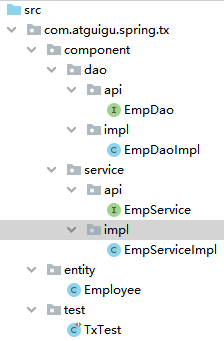
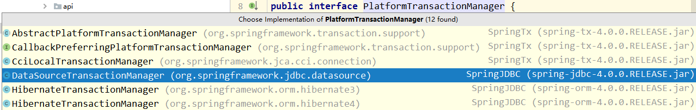
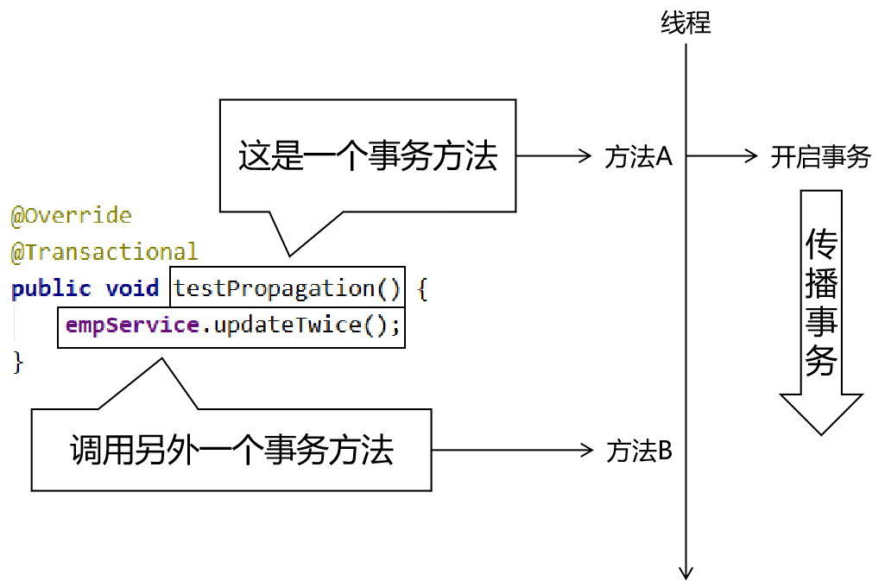

[TOC]

# 一、Spring和junit整合

## 1、所需jar包

commons-logging-1.1.3.jar
hamcrest-core-1.3.jar
junit-4.12.jar
spring-aop-4.0.0.RELEASE.jar
spring-beans-4.0.0.RELEASE.jar
spring-context-4.0.0.RELEASE.jar
spring-core-4.0.0.RELEASE.jar
spring-expression-4.0.0.RELEASE.jar

<span style="color:blue;font-weight:bold;">spring-test-4.0.0.RELEASE.jar</span>

## 2、创建Spring配置文件

```xml
<context:component-scan base-package="com.atguigu.spring.component"/>
```

## 3、创建junit测试类

```java
// 指定SpringJunit运行器
@RunWith(SpringJUnit4ClassRunner.class)

// 指定Spring的配置文件位置。如果有多个，那么在{}中可以使用逗号分开
@ContextConfiguration(value = {"classpath:applicationContext.xml"})
public class JDBCTest {

    // IOC容器中的bean可以在这里直接注入
    @Autowired
    private EmpService empService;

    @Test
    public void testSpringJunit() {
        System.out.println("empService = " + empService);
    }

}
```

# 二、JdbcTemplate

## 1、定位

我们学这个只是暂时用一下，为了学声明式事务才用一下JdbcTemplate。以后Spring整合Mybatis就不再使用JdbcTemplate了。

## 2、介绍

JdbcTemplate是Spring封装的一套访问数据库的简易操作模板。使用的感觉很像DBUtils。

## 3、搭建环境

### ①导入jar包

commons-logging-1.1.3.jar
druid-1.1.9.jar
hamcrest-core-1.3.jar
junit-4.12.jar
mysql-connector-java-5.1.37-bin.jar
spring-aop-4.0.0.RELEASE.jar
spring-beans-4.0.0.RELEASE.jar
spring-context-4.0.0.RELEASE.jar
spring-core-4.0.0.RELEASE.jar
spring-expression-4.0.0.RELEASE.jar
spring-jdbc-4.0.0.RELEASE.jar
spring-orm-4.0.0.RELEASE.jar
spring-test-4.0.0.RELEASE.jar
spring-tx-4.0.0.RELEASE.jar

### ②创建Spring配置文件

```xml
    <!-- 关联外部属性文件 -->
    <context:property-placeholder location="classpath:jdbc.properties"/>

    <!-- 配置数据源 -->
    <bean id="dataSource" class="com.alibaba.druid.pool.DruidDataSource">
        <property name="driverClassName" value="${atguigu.dev.driver}"/>
        <property name="url" value="${atguigu.dev.url}"/>
        <property name="username" value="${atguigu.dev.username}"/>
        <property name="password" value="${atguigu.dev.password}"/>
    </bean>

    <!-- 配置JdbcTemplate -->
    <bean id="jdbcTemplate" class="org.springframework.jdbc.core.JdbcTemplate">
        <!-- 装配数据源 -->
        <property name="dataSource" ref="dataSource"/>
    </bean>
```

### ③准备外部属性文件

```properties
atguigu.dev.driver=com.mysql.jdbc.Driver
atguigu.dev.url=jdbc:mysql://192.168.198.100:3306/mybatis0922?allowMultiQueries=true
atguigu.dev.username=root
atguigu.dev.password=atguigu
```

### ④junit测试类

```java
// 指定SpringJunit运行器
@RunWith(SpringJUnit4ClassRunner.class)

// 指定Spring的配置文件位置。如果有多个，那么在{}中可以使用逗号分开
@ContextConfiguration(value = {"classpath:applicationContext.xml"})
public class JDBCTest {

    @Autowired
    private JdbcTemplate jdbcTemplate;

    @Autowired
    private DataSource dataSource;

    @Test
    public void testConnection() throws SQLException {
        Connection connection = dataSource.getConnection();
        System.out.println("connection = " + connection);
    }

}
```

## 4、访问数据库

### ①查询单个对象

```java
@Test
public void testQueryOneObject() {

    // 1.准备访问数据库要使用的SQL语句
    String sql = "SELECT emp_id,emp_name,emp_salary,emp_age,emp_gender FROM t_emp WHERE emp_id=?";

    // 2.准备SQL的参数
    Integer empId = 2;

    // 3.创建RowMapper对象
    RowMapper<Employee> mapper = new BeanPropertyRowMapper(Employee.class);

    // 4.执行查询
    Employee employee = jdbcTemplate.queryForObject(sql, mapper, empId);

    System.out.println("employee = " + employee);

}
```

### ②查询List

```java
@Test
public void testQueryList() {
    String sql = "SELECT emp_id,emp_name,emp_salary,emp_age,emp_gender FROM t_emp where emp_salary>?";

    // 不管是查询单个对象还是List对象，都是使用RowMapper的方式指定数据库表和实体类的对应关系
    RowMapper<Employee> mapper = new BeanPropertyRowMapper(Employee.class);

    // 由具体调用的方法决定返回的是单个对象还是List
    List<Employee> employeeList = jdbcTemplate.query(sql, mapper, 5000.00);

    for (Employee employee : employeeList) {
        System.out.println("employee = " + employee);
    }
}
```

### ③查询单个值

```java
    @Test
    public void testQuerySingleValue() {

        String sql = "select count(*) from t_emp";

        // 传入Xxx.class这样的类型是用于查询单个值
        Integer count = jdbcTemplate.queryForObject(sql, Integer.class);

        System.out.println("count = " + count);

    }
```

### ④增删改

```java
@Test
public void testUpdate() {

    String sql = "UPDATE t_emp SET emp_name=? WHERE emp_id=?";

    String empName = "UUU";
    Integer empId = 2;

    int result = jdbcTemplate.update(sql, empName, empId);
    System.out.println("result = " + result);

}
```

### ⑤批量操作

一次性执行很多条SQL语句。为了提高效率，我们不是把SQL语句一条一条的发生给数据库，而是一次性发送很多条，让数据库批量执行。因为批量执行，能够节约网络传输所消耗的时间。

```java
    @Test
    public void testBatch() {

        String sql = "UPDATE t_emp SET emp_name=? WHERE emp_id=?";

        // 每一个Object数组封装一条SQL语句所需参数
        // 存放到List集合中对应整个批量操作
        List<Object[]> batchUpdateParam = new ArrayList<>();

        for (int i = 0; i < 10; i++) {
            Object[] param = new Object[2];
            param[0] = "TTT" + i;
            param[1] = i + 11;
            batchUpdateParam.add(param);
        }

        // 根据前面指定的SQL和参数执行批量操作
        int[] result = jdbcTemplate.batchUpdate(sql, batchUpdateParam);

        for (int i = 0; i < result.length; i++) {
            int value = result[i];
            System.out.println("value = " + value);
        }

    }
```

## 5、封装Dao

封装DAO类的目的，是为了屏蔽调用jdbcTemplate方法的细节，让持久化层和业务逻辑层能够彼此分开，实现解耦。

最终实现的效果：业务逻辑层只需要提供要操作数据库的数据，而不必关心这些数据是如何通过调用jdbcTemplate的方法来操作数据库的。让业务逻辑层可以保持代码的纯正——仅包含也业务功能相关的代码。

为了让代码能够更好的实现解耦合，我们声明一个DAO的接口，按照面向接口编程的思路封装DAO类。

```java
public interface IEmpDao {
    
    Emp selectEmpById(Integer empId);
    
    List<Emp> selectAll();
    
    Integer selectEmpCount();
    
    Integer updateEmployee(Emp emp);
    
    Integer deleteEmployeeById(Integer empId);
    
    Integer insertEmployee(Emp emp);
    
}
```

下面是接口的实现类：

```java
@Repository
public class EmpDaoImpl implements IEmpDao {

    @Autowired
    private JdbcTemplate jdbcTemplate;

    @Override
    public Emp selectEmpById(Integer empId) {

        String sql = "select emp_id,emp_name,emp_salary from t_emp where emp_id=?";

        return jdbcTemplate.queryForObject(sql, new BeanPropertyRowMapper<>(Emp.class), empId);
    }

    @Override
    public List<Emp> selectAll() {

        String sql = "select emp_id,emp_name,emp_salary from t_emp";

        return jdbcTemplate.query(sql, new BeanPropertyRowMapper<>(Emp.class));
    }

    @Override
    public Integer selectEmpCount() {

        String sql = "select count(*) from t_emp";

        return jdbcTemplate.queryForObject(sql, Integer.class);
    }

    @Override
    public Integer updateEmployee(Emp emp) {

        String sql = "update t_emp set emp_name=?,emp_salary=? where emp_id=?";

        return jdbcTemplate.update(sql, emp.getEmpName(), emp.getEmpSalary(), emp.getEmpId());
    }

    @Override
    public Integer deleteEmployeeById(Integer empId) {

        String sql = "delete from t_emp where emp_id=?";

        return jdbcTemplate.update(sql, empId);
    }

    @Override
    public Integer insertEmployee(Emp emp) {

        String sql = "insert into t_emp(emp_name,emp_salary) values(?,?)";

        return jdbcTemplate.update(sql, emp.getEmpName(), emp.getEmpSalary());
    }
}
```

注意：不要忘了配置自动扫描的包

```xml
<context:component-scan base-package="com.atguigu.spring.jdbc.component"/>
```

# 三、声明式事务概述

## 0、事务回顾

### ①事务和SQL语句的关系

一个事务中包含多条SQL语句。


### ②事务的ACID属性

- 原子性：一个事务中包含的多个数据库操作，缺一不可。
- 一致性：事务执行之前，整个数据库中的所有数据处于“一致”状态（正确状态）；事务执行之后，数据仍然处于“一致”状态。为了做到这一点，我们会让事务中的所有操作，要么全部成功一起提交，要么在任何一个操作失败后整体回滚。
- 持久性：事务一旦提交，那么就永久保存到数据库中。
- 隔离性：多个事务可以并发执行，参照隔离级别，决定它们相互之间是否会有彼此干扰。

### ③事务执行过程中的并发问题


- 脏读：
  - 初始状态：数据库中age字段数据的值是20
  - T1把age修改为了30
  - T2读取了age现在的值：30
  - T1回滚了自己的操作，age恢复为了原来的20
  - 此时T2读取到的30就是一个不存在的“脏”的数据
- 不可重复读：
  - T1第一次读取age是20
  - T2修改age为30并提交事务，此时age确定修改为了30
  - T1第二次读取age得到的是30
- 幻读：
  - T1第一次执行count(*)返回500
  - T2执行了insert操作
  - T1第二次执行count(*)返回501，感觉像是出现了幻觉

### ④事务的隔离级别

- 读未提交：存在脏读、不可重复读、幻读这些所有问题
- 读已提交：能够解决脏读问题，不可重复读、幻读问题还存在
- 可重复读：能够解决脏读、不可重复读问题，幻读问题还存在
- 串行化：锁定整个表，让对整个表的操作全部排队串行执行。能解决所有并发问题，安全性最好，但是性能极差

## 1、IOC容器和后面这些内容的关系

在Spring中干活，所有的东西肯定都必须在IOC容器中。如果某个对象不在IOC容器中，那么它就不归Spring管。


## 2、编程式事务

事务的相关操作完全由开发人员通过编码实现

```java
try{

	// 开启事务（关闭事务的自动提交）
	connection.setAutoCommit(false);

	// 访问数据库的目标操作
	empDao.updateXxx();
	
	// 提交事务
	connection.commit();

}catch(Exception e){

	// 回滚事务
	connection.rollBack();

}finally{

	// 释放数据库连接
	connection.close();

}
```

## 3、声明式事务

事务的控制交给Spring框架来管理，开发人员只需要在Spring框架的<span style="color:blue;font-weight:bold;">配置文件中声明</span>你需要的功能即可。Spring框架底层基于AOP实现了声明式事务。


# 四、声明式事务具体操作

## 1、搭建环境

### ①导入jar包

com.springsource.net.sf.cglib-2.2.0.jar
com.springsource.org.aopalliance-1.0.0.jar
com.springsource.org.aspectj.weaver-1.6.8.RELEASE.jar
commons-logging-1.1.3.jar
druid-1.1.9.jar
hamcrest-core-1.3.jar
junit-4.12.jar
mysql-connector-java-5.1.37-bin.jar
spring-aop-4.0.0.RELEASE.jar
spring-aspects-4.0.0.RELEASE.jar
spring-beans-4.0.0.RELEASE.jar
spring-context-4.0.0.RELEASE.jar
spring-core-4.0.0.RELEASE.jar
spring-expression-4.0.0.RELEASE.jar
spring-jdbc-4.0.0.RELEASE.jar
spring-orm-4.0.0.RELEASE.jar
spring-test-4.0.0.RELEASE.jar
spring-tx-4.0.0.RELEASE.jar

### ②准备配置文件

#### [1]Spring的配置文件

```xml
<context:component-scan base-package="com.atguigu.spring.tx.component"/>

<!-- 导入外部属性文件 -->
<context:property-placeholder location="classpath:jdbc.properties" />

<!-- 配置数据源 -->
<bean id="dataSource" class="com.alibaba.druid.pool.DruidDataSource">
    <property name="driverClassName" value="${atguigu.dev.driver}"/>
    <property name="url" value="${atguigu.dev.url}"/>
    <property name="username" value="${atguigu.dev.username}"/>
    <property name="password" value="${atguigu.dev.password}"/>
</bean>

<!-- 配置JdbcTemplate -->
<bean id="jdbcTemplate" class="org.springframework.jdbc.core.JdbcTemplate">
    <!-- 装配数据源 -->
    <property name="dataSource" ref="dataSource"/>
</bean>
```

#### [2]jdbc.properties

```xml
atguigu.dev.driver=com.mysql.jdbc.Driver
atguigu.dev.url=jdbc:mysql://192.168.198.100:3306/mybatis0922?allowMultiQueries=true
atguigu.dev.username=root
atguigu.dev.password=atguigu
```

### ③其他组件



### ④junit测试

```java
@RunWith(SpringJUnit4ClassRunner.class)
@ContextConfiguration(value = {"classpath:applicationContext.xml"})
public class TxTest {
    
    @Autowired
    private EmpService empService;
    
    @Autowired
    private DataSource dataSource;
    
    @Test
    public void testConn() throws SQLException {
        Connection connection = dataSource.getConnection();
        System.out.println("connection = " + connection);
    }
}
```

## 2、情景设定


### ①EmpService方法

```java
    @Override
    public void updateTwice() {

        // 1.准备第一次修改所需的数据
        Integer empId = 5;
        String empName = "AAA";

        // 2.执行第一次修改
        empDao.updateEmpName(empId, empName);

        // 3.准备第二次修改所需的数据
        empId = 6;
        empName = "BBB";

        // 4.执行第二次修改
        empDao.updateEmpName(empId, empName);

    }
```

### ②EmpDao方法

```java
    @Override
    public void updateEmpName(Integer empId, String empName) {

        if (empId == 6) {
            throw new RuntimeException("我故意的");
        }

        String sql = "update t_emp set emp_name=? where emp_id=?";

        jdbcTemplate.update(sql, empName, empId);

    }
```

## 3、加入基于注解的声明式事务

### ①配置事务管理器



```xml
<!-- 配置事务管理器的bean -->
<bean id="transactionManager" class="org.springframework.jdbc.datasource.DataSourceTransactionManager">

    <!-- 给事务管理器装配数据源 -->
    <property name="dataSource" ref="dataSource"/>
</bean>
```

### ②开启声明式事务的注解驱动


注意：导入名称空间的时候，不要使用了错误的名称空间。

```xml
<!-- 开启声明式事务的注解驱动 -->
<!-- 在transaction-manager属性中指定前面配置的事务管理器的bean的id -->
<!-- transaction-manager属性的默认值是transactionManager，如果正好前面bean的id就是这个默认值，那么transaction-manager属性可以省略不配 -->
<tx:annotation-driven transaction-manager="transactionManager"/>
```

### ③在需要事务的方法上使用注解

```java
    @Override
    @Transactional
    public void updateTwice() {

        // 1.准备第一次修改所需的数据
        Integer empId = 5;
        String empName = "AAA";

        // 2.执行第一次修改
        empDao.updateEmpName(empId, empName);

        // 3.准备第二次修改所需的数据
        empId = 6;
        empName = "BBB";

        // 4.执行第二次修改
        empDao.updateEmpName(empId, empName);

    }
```

## 4、查看事务管理器源码

org.springframework.jdbc.datasource.DataSourceTransactionManager

### ①提交操作

```java
protected void doCommit(DefaultTransactionStatus status) {
	DataSourceTransactionManager.DataSourceTransactionObject txObject = (DataSourceTransactionManager.DataSourceTransactionObject)status.getTransaction();
	Connection con = txObject.getConnectionHolder().getConnection();
	if (status.isDebug()) {
		this.logger.debug("Committing JDBC transaction on Connection [" + con + "]");
	}

	try {
		con.commit();
	} catch (SQLException var5) {
		throw new TransactionSystemException("Could not commit JDBC transaction", var5);
	}
}
```

### ②回滚操作

```java
protected void doRollback(DefaultTransactionStatus status) {
	DataSourceTransactionManager.DataSourceTransactionObject txObject = (DataSourceTransactionManager.DataSourceTransactionObject)status.getTransaction();
	Connection con = txObject.getConnectionHolder().getConnection();
	if (status.isDebug()) {
		this.logger.debug("Rolling back JDBC transaction on Connection [" + con + "]");
	}

	try {
		con.rollback();
	} catch (SQLException var5) {
		throw new TransactionSystemException("Could not roll back JDBC transaction", var5);
	}
}
```

## 5、@Transactional注解写在类上

### ①写法

```java
@Service
@Transactional
public class EmpServiceImpl implements EmpService {
```

### ②效果

@Transactional注解写在类上之后相当于给类中的每一个方法都加了这个注解。包括注解中设置的属性，也会一起被作用到类中的方法。

### ③特殊情况

如果类上@Transactional注解设置的属性，对具体的某个方法来说不合适，那么就可以在具体的这个方法上再声明一个@Transactional注解，设置自己需要的属性。此处遵循就近原则，离方法近的设置会覆盖离得远的设置。

```java
@Service
@Transactional(readOnly = true)
public class EmpServiceImpl implements EmpService {

    @Autowired
    private EmpDao empDao;

    @Override
    @Transactional(readOnly = false)
    public void updateTwice() {

        // 1.准备第一次修改所需的数据
        Integer empId = 5;
        String empName = "AAA~~~";

        // 2.执行第一次修改
        empDao.updateEmpName(empId, empName);

        // 3.准备第二次修改所需的数据
        empId = 6;
        empName = "BBB~~~";

        // 4.执行第二次修改
        empDao.updateEmpName(empId, empName);

    }

    @Override
    public List<Employee> getAll() {
        return empDao.selectAll();
    }
}
```

在上面的例子中，类上的@Transactional(readOnly = true)注解对getAll()方法有效，对updateTwice()方法无效。updateTwice()方法应用的是它自己的@Transactional(readOnly = false)。

# 五、事务属性

## 1、事务的传播行为

### ①概念

事务方法A直接或间接调用事务方法B，事务方法A已经开启的事务如何传播给方法B来使用。



### ②设置传播行为的属性

```java
@Transactional(readOnly = false, propagation = Propagation.REQUIRED)
```

- 在@Transactional注解中使用propagation属性设置传播行为
- 在Propagation枚举类中封装可选的传播行为
  - REQUIRED：默认值。
    - 当前方法必须工作在事务中。
    - 如果在当前方法执行前，线程上<span style="color:blue;font-weight:bold;">没有已经开启的事务</span>，那么<span style="color:blue;font-weight:bold;">开启新事务</span>，并在这个事务中运行。
    - 如果在当前方法执行前，线程上<span style="color:blue;font-weight:bold;">有已经开启的事务</span>，那么<span style="color:blue;font-weight:bold;">就在这个已经开启的事务中运行</span>。此时有可能和其他方法共用同一个事务。
    - 和其他操作共用事务的<span style="color:blue;font-weight:bold;">隐患</span>是：其他操作回滚，当前自己的操作也会跟着一起被回滚。
  - <span style="color:blue;font-weight:bold;">REQUIRES_NEW</span>：<span style="color:blue;font-weight:bold;">建议使用</span>。
    - 当前方法必须工作在事务中。
    - 不论当前方法运行前，线程上是否已经开启了事务，<span style="color:blue;font-weight:bold;">都会开启新的事务</span>，并在这个事务中运行。
    - 好处：保证当前方法在事务中运行，而且是自己开的事务，这样就不会受其他方法回滚的影响。

### ③测试代码

在EmpServiceImpl中增加了一个方法：updateSingle()

```java
@Override
@Transactional(readOnly = false)
public void updateSingle() {

    Integer empId = 7;
    String empName = "CCC";

    empDao.updateEmpName(empId, empName);
}
```

创建PropagationService接口

```java
public interface PropagationService {

    void testPropagation();

}
```

创建PropagationServiceImpl类

```java
@Service
public class PropagationServiceImpl implements PropagationService {

    @Autowired
    private EmpService empService;


    @Override
    @Transactional
    public void testPropagation() {
        empService.updateTwice();
        empService.updateSingle();
    }
}
```

juni测试代码：

```java
@Autowired
private PropagationService propagationService;

@Test
public void testPropagation() {
    propagationService.testPropagation();
}
```

### ④测试用例

让empService.updateSingle()会抛出异常。

#### [1]情况1：测试REQUIRED

把updateTwice()和updateSingle()这两个方法上都使用下面的设置：

```java
@Transactional(readOnly = false, propagation = Propagation.REQUIRED)
```

效果：两个方法的操作都没有生效，updateSingle()方法回滚，导致updateTwice()也一起被回滚，因为他们都在propagationService.testPropagation()方法开启的同一个事务内。

#### [2]情况2：测试REQUIRES_NEW

把updateTwice()和updateSingle()这两个方法上都使用下面的设置：

```java
@Transactional(readOnly = false, propagation = Propagation.REQUIRES_NEW)
```

效果：

- updateTwice()没有受影响，成功实现了更新
- updateSingle()自己回滚

原因：上面两个方法各自运行在自己的事务中。

### ⑤实际开发中有可能的场景举例

调用的目标方法带有事务，后面的AOP的通知方法也需要事务，它们是在同一个线程内的，存在事务传播行为。


## 2、事务的隔离级别

### ①测试方法说明


### ②情景代码补充

#### [1]EmpDao补充

```java
@Override
public String selectEmpNameById(Integer empId) {

    String sql = "select emp_name from t_emp where emp_id=?";

    return jdbcTemplate.queryForObject(sql, String.class, empId);
}
```

#### [2]EmpService补充

```java
@Override
@Transactional(isolation = Isolation.READ_UNCOMMITTED)
public String getEmpNameById(Integer empId) {
    return empDao.selectEmpNameById(empId);
}

@Override
@Transactional(readOnly = false, propagation = Propagation.REQUIRES_NEW, isolation = Isolation.READ_UNCOMMITTED)
public void updateEmpName(Integer empId, String empName) {
    empDao.updateEmpName(empId, empName);
}
```

### ③设置方式

在@Transactional注解中，使用isolation属性设置事务的隔离级别。可选值包括

```java
public enum Isolation {
    DEFAULT(-1),
    READ_UNCOMMITTED(1),
    READ_COMMITTED(2),
    REPEATABLE_READ(4),
    SERIALIZABLE(8);

    private final int value;

    private Isolation(int value) {
        this.value = value;
    }

    public int value() {
        return this.value;
    }
}
```

### ④测试方法

```java
@Test
public void testReadEmpName() {
    String empName = empService.getEmpNameById(4);
    System.out.println("empName = " + empName);
}

@Test
public void testWriteEmpName() {

    Integer empId = 4;
    String empName = "UUU";

    empService.updateEmpName(empId, empName);
}
```

在读和写方法中分别设置断点，并把两个方法都运行起来

- 在读操作实际执行前让程序停住
- 执行写操作
- 在写操作提交或回滚前执行读操作
- 查看读操作查询到的数据
  - 读未提交：会看到读取了写操作尚未提交的修改
  - 读已提交：会看到写操作尚未提交的修改被无视了

## 3、事务回滚的异常


设置方式

```java
@Override
@Transactional(readOnly = false,
        propagation = Propagation.REQUIRES_NEW,
        isolation = Isolation.READ_COMMITTED,
        rollbackFor = Exception.class
)
public void updateEmpName(Integer empId, String empName) {
    empDao.updateEmpName(empId, empName);
}
```

实际开发时通常也建议设置为根据Exception异常回滚。

## 4、只读属性

一个事务如果是做查询操作，可以设置为只读，此时数据库可以针对查询操作来做优化，有利于提高性能。

```java
@Transactional(readOnly = true)
```

如果是针对增删改方法设置只读属性，则会抛出下面异常：

```java
表面的异常信息：TransientDataAccessResourceException: PreparedStatementCallback
    
根本原因：SQLException: Connection is read-only. Queries leading to data modification are not allowed（连接是只读的。查询导向数据的修改是不允许的。）
```

实际开发时建议把查询操作设置为只读。

## 5、超时属性

一个数据库操作有可能因为网络或死锁等问题卡住很长时间，从而导致数据库连接等资源一直处于被占用的状态。所以我们可以设置一个超时属性，让一个事务执行太长时间后，主动回滚。事务结束后把资源释放出来。

```java
@Override
@Transactional(readOnly = false,
        propagation = Propagation.REQUIRES_NEW,
        isolation = Isolation.READ_COMMITTED,
        rollbackFor = Exception.class,
        timeout = 10
)
public void updateEmpName(Integer empId, String empName) throws FileNotFoundException, InterruptedException {

    TimeUnit.SECONDS.sleep(15);
    
    empDao.updateEmpName(empId, empName);

    // 故意抛出一个编译时异常
    // new FileInputStream("stupid.txt");
}
```

# 六、基于XML的声明式事务

## 1、搭建环境

和前面基于注解的一样。

## 2、配置方式

```xml
<!-- 配置基于XML的声明式事务 -->
<aop:config>
    <!-- 配置事务切面的切入点表达式 -->
    <aop:pointcut id="txPointCut" expression="execution(* *..*Service.*(..))"/>

    <!-- 将切入点表达式和事务通知关联起来 -->
    <aop:advisor advice-ref="txAdvice" pointcut-ref="txPointCut"/>
</aop:config>

<!-- 配置事务通知：包括对事务管理器的关联，还有事务属性 -->
<!-- 如果事务管理器的bean的id正好是transactionManager，则transaction-manager属性可以省略 -->
<tx:advice id="txAdvice" transaction-manager="transactionManager">

    <!-- 给具体的事务方法配置事务属性 -->
    <tx:attributes>

        <!-- 指定具体的事务方法 -->
        <tx:method name="get*" read-only="true"/>
        <tx:method name="query*" read-only="true"/>
        <tx:method name="count*" read-only="true"/>

        <!-- 增删改方法 -->
        <tx:method name="update*" rollback-for="java.lang.Exception" propagation="REQUIRES_NEW"/>
        <tx:method name="insert*" rollback-for="java.lang.Exception" propagation="REQUIRES_NEW"/>
        <tx:method name="delete*" rollback-for="java.lang.Exception" propagation="REQUIRES_NEW"/>
    </tx:attributes>
</tx:advice>
```

## 3、注意

虽然切入点表达式已经定位到了所有需要事务的方法，但是在tx:attributes中还是必须配置事务属性。这两个条件缺一不可。缺少任何一个条件，方法都加不上事务。
另外，tx:advice导入时需要注意名称空间的值


赠送：整个后端学习的经纬体系


声明式事务脑图：

http://naotu.baidu.com/file/483f152491d6263855104dd07ed9729b?token=32a393984e17042c