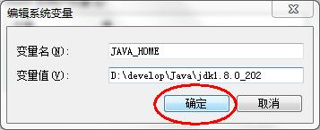

# JDK 8的下载、安装与配置

## 一、下载JDK8

1. 打开官网地址：www.oracle.com 

2. 找到下载页面：

   * 登录Oracle公司官网，www.oracle.com，如图所示：在顶部点击Developer开发者，然后再选择点击[Developer Resource Center](https://developer.oracle.com/)

     

   * 在页面中间的技术分类部分，选择`Java`，单击进入，如图所示：

     

   * 下拉页面，找到**Java SE Technologies**，在此选择`Download Oracle JDK`，单击进入，如图所示：

     

   * 进入页面后，顶部默认是最新版的Java15下载，在此处选择`JDK Download`，单击进入可以下载JDK15，如图所示：
   
     
   
   * 选择对应的操作系统类型，点击进行下载，如图所示
   
     
   
   - 勾选接收协议，点击正式开始下载，如图所示
   
       

  * **如何下载之前JDK版本？**

      * 回到刚才看到最新版JDK15的页面，下拉到最下面，找到[Java Archive ](https://www.oracle.com/java/technologies/oracle-java-archive-downloads.html)（Java档案馆）点击进入，如图所示

        

      * 选择不同历史版本，点击下载

        

      * 例如：这里选择JavaSE 8(8U202 and earlier)，再选择小版本号，并选择对应的操作系统类型，即可下载。早期版本分为32位/64位操作系统区分，其中x86表示32位，x64表示64位。

        

## 二、JDK8的安装

* 安装步骤：

  * 双击`jdk-8u202-windows-x64.exe`文件，并单击`下一步`，如图所示：

    

  * 取消独立JRE的安装，单击`公共JRE前的下拉列表`，选择`此功能将不可用`如图所示：

    

  * 修改安装路径，单击更改，如图所示：

    

  * 将安装路径修改为`D:\develop\Java\jdk1.8.0_202\`，并单击确定，如图所示：

    

  * 单击下一步，如图所示：

    

  * 稍后几秒，安装完成，如图所示：

    

  * 目录结构，如图所示：

    

## 三、 配置环境变量

为什么配置path？

希望在命令行使用javac.exe等工具时，任意目录下都可以找到这个工具所在的目录。

例如：我们在C:\Users\Irene目录下使用java命令，结果如下：

我们在JDK的安装目录的bin目录下使用java命令，结果如下：

我们不可能每次使用java.exe，javac.exe等工具的时候都进入到JDK的安装目录下，太麻烦了。我们希望在任意目录下都可以使用JDK的bin目录的开发工具，因此我们需要告诉操作系统去哪里找这些开发工具，这就需要配置path环境变量。

### 1.只配置path

* 步骤：

  * 打开桌面上的计算机，进入后在左侧找到`计算机`，单击鼠标`右键`，选择`属性`，如图所示：

    

  * 选择`高级系统设置`，如图所示：

    

  * 在`高级`选项卡，单击`环境变量`，如图所示：

    

  * 在`系统变量`中，选中`Path` 环境变量，`双击`或者`点击编辑` ,如图所示：

    

  * 在变量值的最前面，键入`D:\develop\Java\jdk1.8.0_202\bin;`  分号必须要写，而且还要是**英文符号**。如图所示：

    

  * 环境变量配置完成，**重新开启**DOS命令行，在任意目录下输入`javac` 命令，运行成功。

    

### 2. 配置JAVA_HOME+path

* 步骤：

  * 打开桌面上的计算机，进入后在左侧找到`计算机`，单击鼠标`右键`，选择`属性`，如图所示：

    

  * 选择`高级系统设置`，如图所示：

    

  * 在`高级`选项卡，单击`环境变量`，如图所示：

    

  * 在`系统变量`中，单击`新建` ，创建新的环境变量，如图所示：

    

  * 变量名输入`JAVA_HOME`，变量值输入 `D:\develop\Java\jdk1.8.0_202` ，并单击`确定`，如图所示：

    

  * 选中`Path` 环境变量，`双击`或者`点击编辑` ,如图所示：

    

  * 在变量值的最前面，键入`%JAVA_HOME%\bin;`  分号必须要写，而且还要是**英文符号**。如图所示：

    

  * 环境变量配置完成，**重新开启**DOS命令行，在任意目录下输入`javac` 命令，运行成功。

    

#### 在path中使用JAVA_HOME重启失效？

“D:\ProgramFiles\Java\jdk1.8.0_141\bin”替换为“%JAVA_HOME%\bin”，因为根据之前班级经验，很多同学电脑这样修改之后，每次重启电脑都需要重新配置环境变量，即操作系统都无法正确读取该环境变量的值。 

 

解决：配置正确的情况下，以管理员身份打开CMD命令行窗口，执行一次javac。